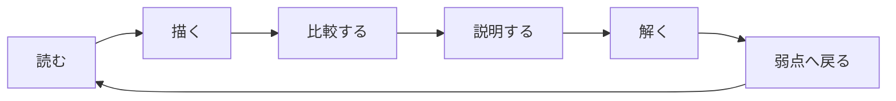

# AWS Mastering Learning Path

この学習順序は、サービス数を消化するためのものではない。

**読む → 描く → 比較する → 説明する → 解く → 弱点へ戻る**、を繰り返す。



---

# Phase 0 — 入口を決める

最初に [START_HERE.md](START_HERE.md) を読む。

今の状態を選ぶ。

- AWS用語そのものが曖昧
- システム全体の流れが見えない
- サービス比較で迷う
- SAP問題で制約を拾えない
- 特定Taskだけ弱い

## 完了条件

次に読む一冊または一章を一つだけ選べる。

---

# Phase 1 — システムの流れを理解する

読む：

1. [第1章: RequestからDataまで](guide/01-request-to-data.md)
2. [図解アトラス](guide/DIAGRAM_ATLAS.md)

## 作る成果物

次の図を自分で描く。

```text
User
  → DNS / Edge
  → Entry
  → Compute
  → Integration
  → State
```

矢印へ次のどれかを書く。

- HTTPS request
- message
- event
- SQL read/write
- replication
- AssumeRole

## 完了条件

- Route 53の回答と実通信を分けられる
- Edge、Entry、Computeを分けられる
- 同期と非同期を分けられる
- Source of truth、Cache、Replica、Backupを指せる
- EventBridge、SQS、Step Functionsの役割を分けられる

---

# Phase 2 — 設計判断の型を作る

読む：

1. [第2章: 要件から設計を選ぶ](guide/02-design-decisions.md)
2. [AWS意思決定マップ](guide/QUICK_DECISION_MAP.md)
3. [AWS SAP設計読本](SAP_DESIGN_READER.md)

## 作る成果物

一つの設計についてDecision recordを書く。

```text
目的:
前提:
Must:
Preference:
候補:
採用:
採用理由:
不採用理由:
障害時:
残る運用責任:
Cost driver:
```

## 完了条件

- 目的と手段を分けられる
- MustとPreferenceを分けられる
- 同じ比較軸で候補を比べられる
- 「最小運用」「最小コスト」「高可用」を具体化できる
- 採用理由と不採用理由を一文ずつ書ける

---

# Phase 3 — 障害と回復を理解する

読む：

1. [第3章: 障害と回復](guide/03-failure-recovery.md)
2. `architecture/` と `patterns/` のDR関連ページ
3. [Continuous Improvement Playbook](CONTINUOUS_IMPROVEMENT_PLAYBOOK.md)のRecovery部分

## 作る成果物

Failure mode tableを一つ作る。

| Failure | Detection | Automatic action | Manual action | Verification |
|---|---|---|---|---|
| 例: ECS Task停止 | Target health | Task replacement | 原因調査 | API canary |

## 完了条件

- HA、Backup、DRを分けられる
- Multi-AZ、Read Replica、Backupの主目的を分けられる
- RTO/RPOからDR戦略を選べる
- Retry、Backoff、Jitter、Idempotencyを説明できる
- Technical healthとBusiness healthを分けられる

---

# Phase 4 — 運用と変更を理解する

読む：

1. [第4章: 運用と変更](guide/04-operation-change.md)
2. [Deployment and Rollback](comparisons/deployment-and-rollback-strategies.md)
3. [Continuous Improvement Playbook](CONTINUOUS_IMPROVEMENT_PLAYBOOK.md)

## 作る成果物

次を一つずつ作る。

- SLOと対応Metric
- AlarmからActionまでの経路
- Blue/GreenまたはCanaryの図
- Runbookの最小版

## 完了条件

- Metrics、Logs、Tracesを分けられる
- CloudTrailとConfigを分けられる
- Blue/Green、Canary、Rollingを選べる
- Traffic rollbackとDatabase rollbackを分けられる
- AutomationへGuardrailが必要な理由を説明できる
- 改善をService導入数ではなくSLO/KPI/Costで測れる

---

# Phase 5 — 移行を時間軸で理解する

読む：

1. [第5章: 移行とModernization](guide/05-migration-modernization.md)
2. [Migration and Modernization Reader](MIGRATION_AND_MODERNIZATION_READER.md)
3. `services/migration/`

## 作る成果物

一つのWorkloadについて次を書く。

```text
Dependencies:
7R:
Wave:
Landing Zone prerequisites:
Replication / Transfer:
Test:
Cutover:
Rollback deadline:
Hypercare exit:
Modernization backlog:
```

## 完了条件

- Portfolio、Workload、Componentを分けられる
- 7Rを順位ではなく制約で選べる
- MGN、DMS、DataSync、Snow Familyを対象で分けられる
- Change rateを含めて移行時間を考えられる
- Traffic rollbackとData divergenceを説明できる

---

# Phase 6 — 横断テーマを深める

理解が浅いテーマだけ選ぶ。

## Performance

- [Performance Design Reader](PERFORMANCE_DESIGN_READER.md)
- 症状 → Metric → Bottleneck → 改善 → 検証

## Network / DNS

- [Networking Foundations](comparisons/networking-foundations-deep-dive.md)
- [Hybrid DNS](comparisons/hybrid-dns-deep-dive.md)
- 名前解決とReachabilityを分ける

## Cost

- [Cost Modeling and Data Transfer](comparisons/cost-modeling-and-data-transfer.md)
- [Cost Optimization](comparisons/cost-optimization-comparison.md)
- Visibility → Waste → Rightsize → Architecture → Commitment

## Integration

- [Messaging and Eventing](comparisons/messaging-eventing-comparison.md)
- Queue、Router、Pub/Sub、Workflow、Streamを分ける

## Identity / Security

- [Access Control and Encryption](comparisons/access-control-and-encryption.md)
- [IAM Boundaries / SCP / Condition](comparisons/iam-boundaries-scp-condition-deep-dive.md)
- Human、Workload、Application userを分ける

## Storage / Database

- [Storage comparison](comparisons/storage-comparison.md)
- [RDS / Aurora Connection](comparisons/rds-aurora-connection-deep-dive.md)
- Object、Block、File、Transaction、Cacheを分ける

## 完了条件

選んだテーマを、図一枚とDecision rule一文で説明できる。

---

# Phase 7 — SAP-C02へ適用する

読む：

1. [第6章: SAP長文](guide/06-sap-exam.md)
2. [SAP-C02カバレッジマトリクス](SAP_C02_COVERAGE_MATRIX.md)
3. `practice/`
4. `sap-c02/`

## 一問ごとに残す

```text
最後の質問:
Current:
Goal:
Must:
Preference:
対象レイヤー:
Flow:
Source of truth:
採用理由:
誤答理由:
間違えた原因:
戻る教材:
```

## 誤答原因の分類

- 用語
- Flow
- State
- Service role
- Constraint
- Failure behavior
- Cost / Operations
- Migration timeline
- 複数正解の組み合わせ

## 完了条件

- 強い制約語を拾える
- 選択肢を失格条件で落とせる
- 複数正解で必須構成を選べる
- 正解と誤答の理由を同じ比較軸で説明できる

---

# Phase 8 — 公式Task単位で仕上げる

[SAP-C02カバレッジマトリクス](SAP_C02_COVERAGE_MATRIX.md)へ戻る。

Taskごとに判定する。

```text
説明できる:
比較できる:
図を描ける:
障害時を説明できる:
誤答理由を言える:
Scenarioを解ける:
```

弱いTaskだけ、ガイド → 比較表 → サービス辞書 → 問題、の順に戻る。

---

# 学習時間別の使い方

## 30分

- START_HERE
- 意思決定マップ
- 弱いテーマの図一枚

## 2時間

- Guideの一章
- Decision recordまたはFailure table作成
- Scenarioを2〜3問

## 1週間

- Guide 6章を通読
- 各章の成果物を一つずつ作成
- Coverage matrixで弱点を3つ選ぶ

## 4週間

- Week 1: Flow / Decision
- Week 2: Failure / Operations
- Week 3: Migration / Cross-domain
- Week 4: Practice / Weakness repair

---

# 最終判定

学習完了とは、AWSサービス名を多く言えることではない。

次を何も見ずに説明できること。

```text
利用者のRequestがどこを通るか。
Stateの正本がどこにあるか。
どこが壊れ得るか。
どう検知し、切り替え、戻すか。
どの制約でサービスを選ぶか。
なぜ他の選択肢ではないか。
変更と移行をどう安全に行うか。
```

教材を編集する場合は [EDITORIAL_GUIDE.md](EDITORIAL_GUIDE.md) に従う。
