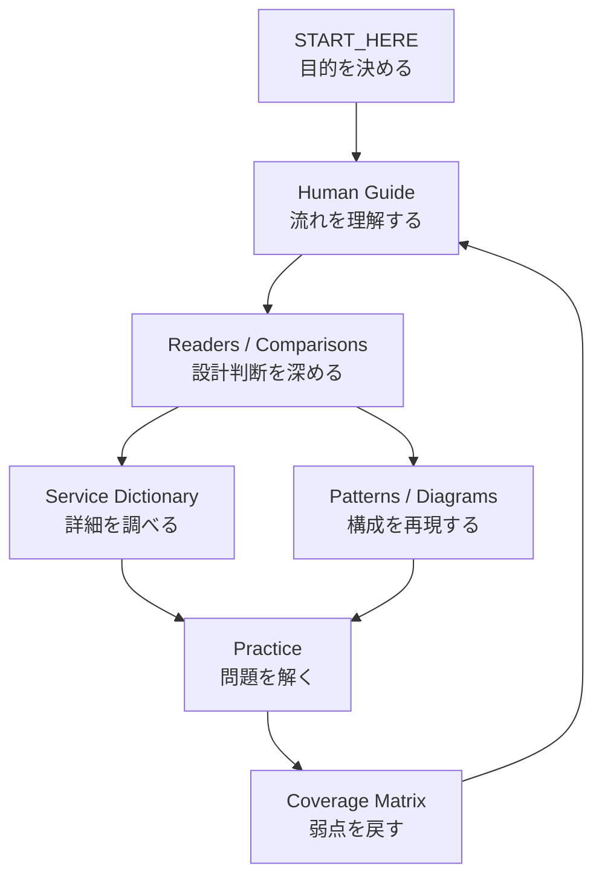

# AWS Mastering

**AWSを、サービス名の暗記ではなく「流れ・状態・責任・障害・判断」で理解するための学習リポジトリ。**

SAP-C02対策と、実務で「なぜこの設計なのか」を説明できる力の両方を扱う。

---

# ここから始める

## 初めて来た人

👉 **[START_HERE.md](START_HERE.md)**

今の理解度と目的から、読む場所を選べる。

## システムを順番に理解したい人

👉 **[人間向けAWS設計ガイド](guide/README.md)**

```text
Requestの流れ
  → 設計判断
  → 障害と回復
  → 運用と変更
  → 移行
  → SAP長文
```

## 特定のテーマで迷っている人

👉 **[AWS意思決定マップ](guide/QUICK_DECISION_MAP.md)**

入口、Compute、非同期連携、Database、Storage、Network、Identity、DR、Migrationを短時間で比較できる。

---

# このリポジトリの全体像



情報は、最初から全部読むために並べていない。

**理解する → 描く → 比較する → 解く → 弱点へ戻る**、の循環で使う。

---

# 人間向け設計ガイド

| 章 | 読者の問い |
|---|---|
| [第1章: RequestからDataまで](guide/01-request-to-data.md) | クリックした後、何が起きるのか |
| [第2章: 設計判断](guide/02-design-decisions.md) | なぜそのサービスを選ぶのか |
| [第3章: 障害と回復](guide/03-failure-recovery.md) | どこが壊れ、どう戻るのか |
| [第4章: 運用と変更](guide/04-operation-change.md) | どう観測し、安全に変更するのか |
| [第5章: 移行とModernization](guide/05-migration-modernization.md) | 既存環境をどう動かすのか |
| [第6章: SAP長文](guide/06-sap-exam.md) | 長い問題文をどう解くのか |
| [図解アトラス](guide/DIAGRAM_ATLAS.md) | 構成をどう描くのか |

---

# 長文読本

短いガイドで全体をつかんだ後、必要なテーマだけ深掘りする。

| 読本 | 主題 |
|---|---|
| [AWS「説明の説明」](EXPLANATION_OF_EXPLANATIONS.md) | `proxy`、`endpoint`、`replication`などを具体的動作へ展開する |
| [AWS SAP設計読本](SAP_DESIGN_READER.md) | 要件、制約、候補、比較、不採用理由から設計を選ぶ |
| [Performance Design Reader](PERFORMANCE_DESIGN_READER.md) | 症状からBottleneckを特定し改善する |
| [Continuous Improvement Playbook](CONTINUOUS_IMPROVEMENT_PLAYBOOK.md) | 観測、変更、検証、標準化を反復する |
| [Migration and Modernization Reader](MIGRATION_AND_MODERNIZATION_READER.md) | Portfolio、7R、Wave、Cutover、Modernization |

公式試験範囲との対応は **[SAP-C02カバレッジマトリクス](SAP_C02_COVERAGE_MATRIX.md)** で確認する。

---

# 比較と深掘り

`comparisons/`は、似たサービスを同じ比較軸で判断する場所である。

- [Deployment and Rollback](comparisons/deployment-and-rollback-strategies.md)
- [Hybrid DNS](comparisons/hybrid-dns-deep-dive.md)
- [Cost Modeling and Data Transfer](comparisons/cost-modeling-and-data-transfer.md)
- [Messaging and Eventing](comparisons/messaging-eventing-comparison.md)
- [Storage](comparisons/storage-comparison.md)
- [Edge Security](comparisons/edge-security-comparison.md)
- [Networking Foundations](comparisons/networking-foundations-deep-dive.md)
- [IAM Boundaries / SCP / Condition](comparisons/iam-boundaries-scp-condition-deep-dive.md)
- [RDS / Aurora Connection](comparisons/rds-aurora-connection-deep-dive.md)

---

# 辞書・構成・演習

## サービスを調べる

- [SERVICES_INDEX.md](SERVICES_INDEX.md)
- `services/`
- `glossary/`

## 構成を学ぶ

- `patterns/`
- `architecture/`
- `architecture-diagrams/`
- [図解アトラス](guide/DIAGRAM_ATLAS.md)

## 問題を解く

- `practice/`
- `sap-c02/`
- [SAP長文の読み方](guide/06-sap-exam.md)

---

# 二つの思考フレーム

## 説明を読む

```text
誰が
  → 何を
  → どこへ
  → いつ
  → どうやって
  → なぜ
  → どんな代償で
```

さらに確認する。

- 通信経路
- Dataの正本
- Stateの保持者
- 障害時の動作
- 運用責任
- 比較対象

## 設計を選ぶ

```text
目的
  → 前提
  → 制約
  → 候補
  → 比較
  → 決定
  → 不採用理由
```

サービス名を見つけて飛びつかず、強い制約を満たさない案から落とす。

---

# 図の原則

図は装飾ではなく、関係を外に出すために使う。

図が必要な場面：

- 3主体以上
- 時間順序
- 分岐
- Account / VPC / AZ / Region境界
- 正本とReplica
- Failover / Cutover

矢印には必ず意味を書く。

```text
HTTPS request
message
business event
SQL read/write
replication
AssumeRole
metrics / logs
```

詳しくは[図解アトラス](guide/DIAGRAM_ATLAS.md)を参照する。

---

# 教材を追加・編集する人へ

👉 **[EDITORIAL_GUIDE.md](EDITORIAL_GUIDE.md)**

新しいページは、原則として次の順で構成する。

```text
30秒要約
  → 最初の一枚
  → 仕組み
  → 選ぶ条件
  → 選ばない条件
  → 障害時
  → 詳細
  → 確認問題
```

詳細を増やす前に、読者が中心概念を持ち帰れる順序になっているか確認する。

---

# 学習の完了条件

ページを読み終えたことではなく、次を説明できること。

> この要件ではAを選ぶ。Bも技術的には可能だが、状態の置き場所、障害時の動作、運用責任、コスト、または移行制約が合わないため選ばない。

体系的な順序は **[LEARNING_PATH.md](LEARNING_PATH.md)** を使う。
