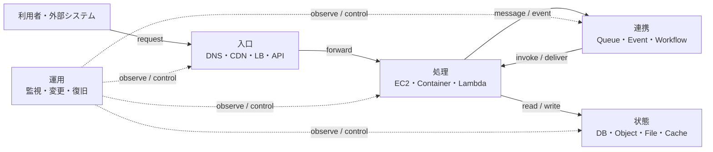
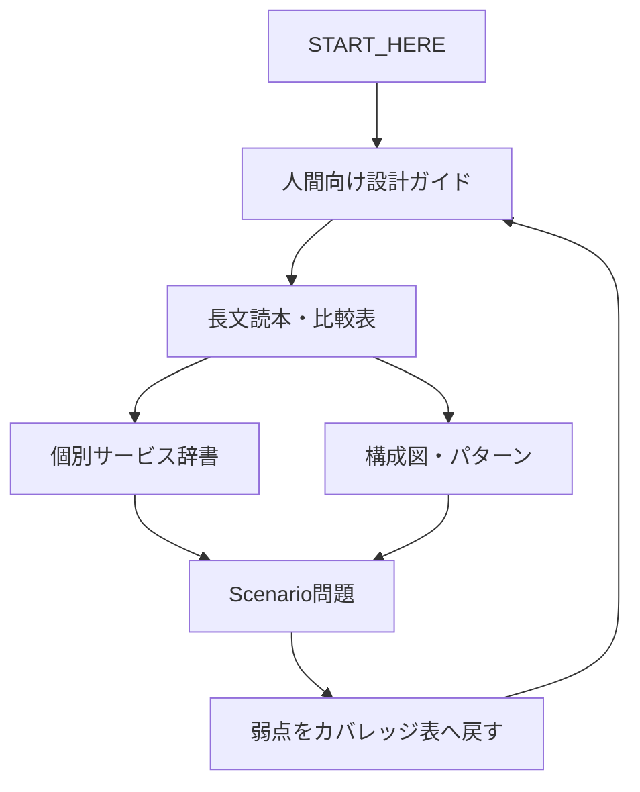

# ここから始める — AWSを「読める・描ける・選べる」にする

このリポジトリには、サービス辞書、比較表、長文読本、設計パターン、試験問題がある。

情報量は十分に増えた。次に必要なのは、**どこから入り、どの深さまで読み、どこで立ち止まるかが分かる構造**である。

このページは本棚の入口である。最初からすべて読まない。今の目的に合う入口を一つ選ぶ。

---

## まず自分の状態を選ぶ

| 今の状態 | 最初に読む | 到達点 |
|---|---|---|
| AWSの説明文そのものが難しい | [AWS「説明の説明」](EXPLANATION_OF_EXPLANATIONS.md) | `proxy`、`endpoint`、`replication`などを具体的な動作へ展開できる |
| サービスは知っているが設計問題で迷う | [人間向け設計ガイド](guide/README.md) | システム全体を通信・状態・責任・障害で読める |
| SAP-C02の学習順序を決めたい | [学習ロードマップ](LEARNING_PATH.md) | 読む→描く→比較する→解く、の順序が決まる |
| 公式範囲の弱点を知りたい | [カバレッジマトリクス](SAP_C02_COVERAGE_MATRIX.md) | 20タスク単位で不足を特定できる |
| 特定サービスだけ調べたい | [サービス索引](SERVICES_INDEX.md) | サービスページと比較対象へ移動できる |
| 問題演習をしたい | [試験読解ガイド](guide/06-sap-exam.md) | 制約語と誤答理由で問題を解ける |

---

# 15分で全体像をつかむ

次の図を見て、AWSアーキテクチャを「サービスの集合」ではなく「処理の流れ」として読む。



AWSの問題は、ほぼ次の六つの問いへ分解できる。

1. **誰が入口へ来るのか**
2. **入口は何を見て振り分けるのか**
3. **処理はどこで実行されるのか**
4. **処理同士を同期でつなぐか、非同期で切り離すか**
5. **正しい状態はどこに保存されるのか**
6. **障害、変更、復旧を誰が管理するのか**

サービス名が分からなくても、この六問を先に埋める。

---

# 読む深さを三段階に分ける

すべてのテーマを同じ深さで読む必要はない。

## Level 1 — 30秒

知ることは三つだけ。

- 一言でいうと何か
- 何を解決するか
- 何とは違うか

例：

> SQSは、処理要求を一時的に保持して送信側と処理側の速度差を吸収するQueueである。EventBridgeのようなイベントルーターでも、Step Functionsのような手順管理でもない。

## Level 2 — 5分

次を理解する。

- 入力
- 処理
- 出力
- 通信経路
- 状態の場所
- 障害時の動作

## Level 3 — 20分以上

設計判断まで進む。

- 選ぶ条件
- 選ばない条件
- 比較対象
- コスト要因
- 運用責任
- 制約と上限
- SAPでの誤答パターン

初回はLevel 1と図だけでよい。問題で迷った箇所だけLevel 2、Level 3へ降りる。

---

# 図はいつ必要か

次のどれかに当てはまるなら図を使う。

- 登場人物やサービスが3つ以上ある
- 処理に順番がある
- 正常系と異常系が分岐する
- Public / Private、Account、VPC、AZ、Regionなどの境界がある
- データの正本と複製先が異なる
- Control planeとData planeが分かれる
- FailoverやCutoverで接続先が変わる

反対に、単語の定義、二つだけの単純比較、料金項目の列挙には、無理に図を使わない。

図では、矢印に必ず意味を書く。

悪い図：

```text
A → B → C
```

良い図：

```text
Client
  → HTTPS request
ALB
  → forwarded HTTP request
ECS Task
  → SQL query
Aurora
```

矢印が通信、イベント、複製、権限継承、監視のどれか分からない図は、箱を増やしても理解を助けない。

---

# 人間向け設計ガイドの読み順

サービスカテゴリ順ではなく、人がシステムを理解する順に並べている。

1. [一つのリクエストがデータへ届くまで](guide/01-request-to-data.md)
2. [要件から設計を選ぶ](guide/02-design-decisions.md)
3. [どこが壊れ、どう回復するか](guide/03-failure-recovery.md)
4. [どう観測し、変更し、改善するか](guide/04-operation-change.md)
5. [既存環境をどう移し、変えるか](guide/05-migration-modernization.md)
6. [SAP-C02の長文をどう読むか](guide/06-sap-exam.md)
7. [図解アトラス](guide/DIAGRAM_ATLAS.md)

この順序は、利用者の体験から始まり、内部構造、障害、運用、移行、試験へ進む。

---

# 迷ったときの一枚メモ

```text
【目的】
誰に、どんな結果を提供するか:

【流れ】
入口:
処理:
連携:
状態:

【制約】
停止時間:
RTO / RPO:
性能:
セキュリティ:
コスト:
運用人数:

【判断】
採用:
比較対象:
不採用理由:

【障害】
壊れる場所:
検知:
切替 / 再試行:
復旧確認:
```

このメモが埋まらない部分が、次に読むべき部分である。

---

# このリポジトリの読み方



この循環を繰り返す。

**完成とは、ページを読み終えることではない。**

次の説明ができる状態を完成とする。

> この要件ではAを選ぶ。Bも技術的には可能だが、障害時の動作、運用責任、コスト、または移行制約が合わないため選ばない。
