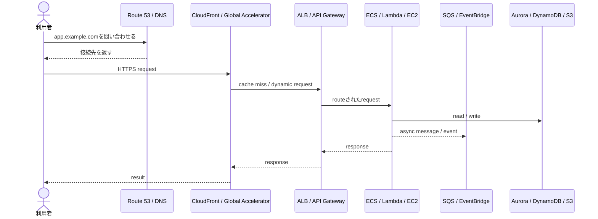
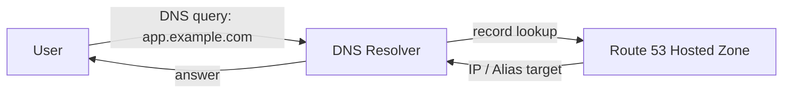
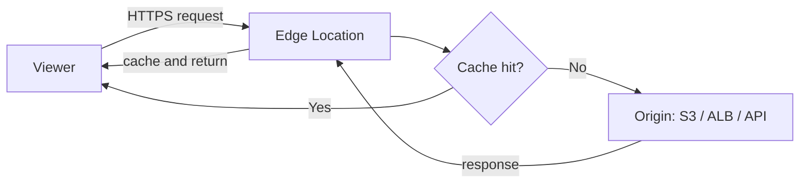
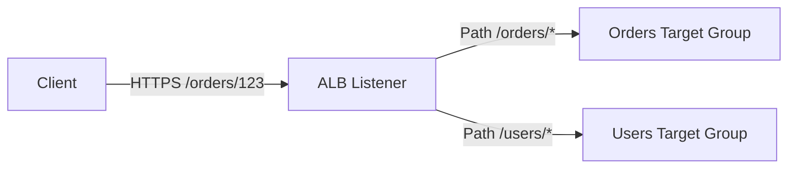
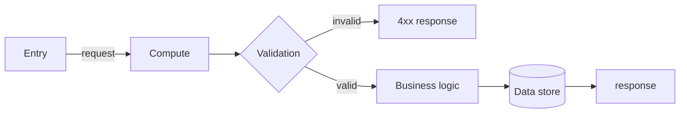
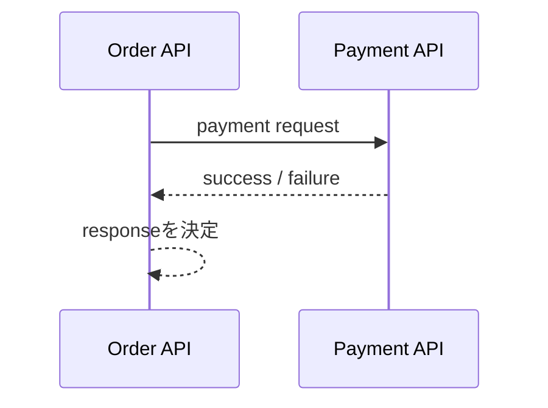
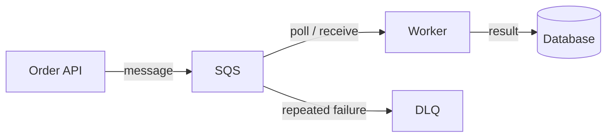
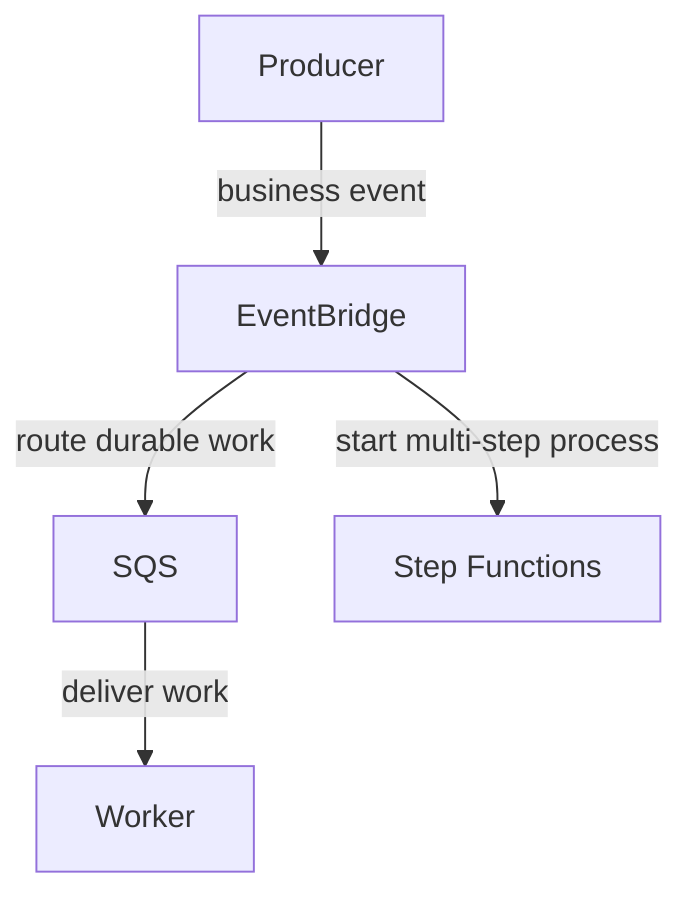
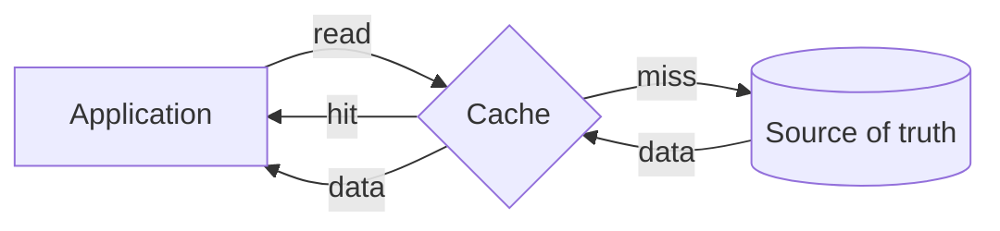
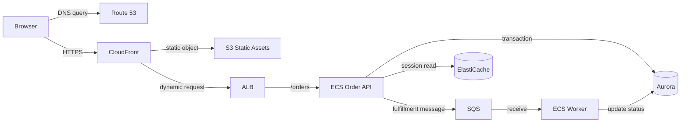

# 第1章 — 一つのリクエストがデータへ届くまで

## 30秒要約

Webシステムは、利用者の操作をそのままDBへ届けるものではない。

```text
名前を解決する
  → 入口へ接続する
  → 通信を振り分ける
  → コードを実行する
  → 必要なら非同期処理へ渡す
  → 状態を読む・書く
  → 結果を返す
```

AWSサービスは、この流れのどこを担当するかで理解する。

---

# 最初の一枚



この図は代表例であり、すべてのサービスを置く必要はない。

重要なのは、各矢印の意味を説明できることである。

---

# 1. 利用者はサービス名ではなく名前を知っている

利用者は通常、ALBのIPアドレスやEC2のInstance IDを知らない。

知っているのは次のような名前である。

```text
app.example.com
api.example.com
```

DNSは名前を接続先情報へ変換する。



## ここで混同しやすいこと

DNSが成功しても、通信できるとは限らない。

DNSが答えるのは接続先である。次は別に成立する必要がある。

- Route
- Security Group
- Network ACL
- Listener
- Target health
- Application process

## 読み替え

> Route 53がアプリケーションへ接続する。

ではなく、より正確には次のように読む。

> Route 53は、利用者が指定した名前に対して接続先を回答する。その回答を使い、利用者側が実際の通信を開始する。

---

# 2. Edgeは利用者に近い入口である

CloudFrontやGlobal Acceleratorは、利用者から見てAWSシステムの手前に置かれる。

ただし、同じ役割ではない。

| サービス | 主に扱うもの | 中心目的 |
|---|---|---|
| CloudFront | HTTP/HTTPS content | Cache、Edge配信、Origin保護 |
| Global Accelerator | TCP/UDP connection | 固定Anycast IP、AWS Global Network、Endpoint切替 |
| Route 53 | DNS answer | 名前解決、Routing policy |

## CloudFrontの流れ



Cacheは「データを速くする魔法」ではない。

次の条件がある。

- 同じCache keyで再利用できる
- TTLとInvalidationを設計する
- 古い結果を返してよい範囲を決める
- User固有情報を誤って共有しない

---

# 3. 入口は何を見て振り分けるか

入口は一種類ではない。

## ALB

HTTP/HTTPSの内容を見て振り分ける。

```text
Host: api.example.com
Path: /orders/*
Header: X-Tenant: blue
```



## NLB

TCP/UDP/TLS接続を高性能に転送する。HTTP pathを理解して振り分けることが中心ではない。

## API Gateway

APIを公開・管理する入口である。

- Authentication / Authorization連携
- Throttling
- Request transformation
- API stage
- Usage plan
- WebSocket

## 選び方

| 問い | 候補 |
|---|---|
| HTTP pathやhostでContainerへ分けたい | ALB |
| 固定IP、TCP/UDP、高い接続性能が必要 | NLB |
| API認証、Throttle、Usage管理が必要 | API Gateway |
| CacheとGlobal HTTP配信が必要 | CloudFront |

入口はコードの実行場所ではない。

ALBやCloudFrontが注文処理を行うのではなく、後段へRequestを渡す。

---

# 4. Computeはコードを実行する場所である

Computeを選ぶとき、最初に「何が実行できるか」だけを見ない。

次の責任を誰が持つかを見る。

| 選択 | 利用者が主に管理するもの |
|---|---|
| EC2 | OS、Patch、Runtime、Capacity、Application |
| ECS on EC2 | EC2 Fleet、Container、Task、Scaling |
| ECS on Fargate | Container image、Task definition、Scaling |
| EKS | Kubernetes設計、Addon、Worker方式、Workload |
| Lambda | Function code、Event、Concurrency、Timeout |

## 処理の流れ



## Statelessという考え方

Application serverのLocal memoryやLocal diskだけにSessionや処理状態を置くと、そのInstanceへ戻れない場合に問題が起きる。

```text
Bad:
User session → EC2-A memory only

Better:
User session → ElastiCache / DynamoDB / signed token
App instance → replaceable
```

Statelessとは「状態が存在しない」ではない。

**状態を交換可能なComputeの外へ置く**という意味で読む。

---

# 5. 同期でつなぐか、非同期で切り離すか

## 同期

呼び出し元が結果を待つ。



向くもの:

- その場で結果が必要
- User responseに直結
- 短時間で完了

弱点:

- 後段遅延が前段へ伝播する
- 後段停止時に全体が失敗する

## 非同期

処理要求を預け、完了を待たずに次へ進む。



向くもの:

- 処理時間が長い
- 急増を平準化したい
- 後段停止中も要求を失いたくない
- 再試行を独立させたい

代償:

- 即時完了ではない
- 重複処理へ備える
- 状態確認方法が必要
- 順序や期限を設計する

---

# 6. Queue、Event、Workflowを分ける

## Queue

未処理Workを保持し、Workerが取り出す。

- SQS
- Amazon MQなど

## Event router

発生した事実を内容で振り分ける。

- EventBridge
- SNSのPublish/Subscribe

## Workflow

処理手順と状態遷移を管理する。

- Step Functions



一つのサービスに全役割を押し込めない。

---

# 7. Stateはどこにあるか

システムを理解する最短の質問は、**正しいデータはどこにあるか**である。

| State | 代表的な保存先 |
|---|---|
| Transaction data | Aurora / RDS / DynamoDB |
| Object | S3 |
| Shared file | EFS / FSx |
| Session | ElastiCache / DynamoDB / Token |
| Cache | CloudFront / ElastiCache / DAX |
| Pending work | SQS / Stream |
| Workflow state | Step Functions |
| Configuration | Parameter Store / AppConfig |
| Secret | Secrets Manager |

## Cacheと正本



Cacheを失っても正本から再構築できる設計が基本である。

## ReplicaとBackup

- Replica: 現在状態を追従し、可用性やRead scaleへ使う
- Backup: 過去時点へ戻す

誤削除がReplicaへ複製される可能性があるため、ReplicaだけではBackupにならない。

---

# 8. Responseはどこで作られるか

通常、Business responseはApplicationが作る。

入口は次を付加・変換できる。

- HTTP status
- Header
- Compression
- Cache
- Authentication result
- Error mapping

しかし、注文が成立したか、在庫があるかなどのBusiness decisionはApplicationとDataが担う。

---

# 9. 一つの例を最後まで追う

## 商品画像付きECサイト



## この図から読むこと

- Static assetはS3が正本
- OrderはAuroraが正本
- SessionはElastiCacheへ外出し
- 注文受付は同期
- 配送手配はSQS経由で非同期
- CloudFrontはBusiness logicを実行しない
- Worker停止中もSQSが要求を保持する

---

# 障害時に確認する

| 障害 | 起きること | 主な対策 |
|---|---|---|
| DNS誤設定 | 正しい入口へ到達できない | Record review、Health check、TTL計画 |
| Edge障害・設定不備 | Cache/Origin到達に失敗 | Origin failover、設定検証 |
| Unhealthy target | ALBが転送対象から外す | Multi-AZ target、Auto Scaling |
| App overload | Latency、5xx | Scaling、Queue、Backpressure |
| DB connection枯渇 | AppがDBへ接続できない | Pool、RDS Proxy、Concurrency制御 |
| Worker停止 | Queue ageが増える | Scaling、Alarm、DLQ |
| Cache loss | Miss増加、DB負荷増加 | Warm-up、Rate limit、DB capacity |

---

# 確認問題

1. Route 53が名前を回答した後、通信成立に必要な要素を三つ挙げられるか。
2. CloudFrontとGlobal Acceleratorの中心目的を分けられるか。
3. ALBとApplication serverの責任を分けられるか。
4. Statelessが「状態なし」ではない理由を説明できるか。
5. 同期処理をSQSへ変えると、何を得て何を失うか。
6. EventBridge、SQS、Step Functionsの役割を一文ずつ説明できるか。
7. Cache、Replica、Backupの違いを説明できるか。
8. 上のECサイト図で、各データの正本を指せるか。

答えられない箇所は、[図解アトラス](DIAGRAM_ATLAS.md)と個別サービスページへ進む。
