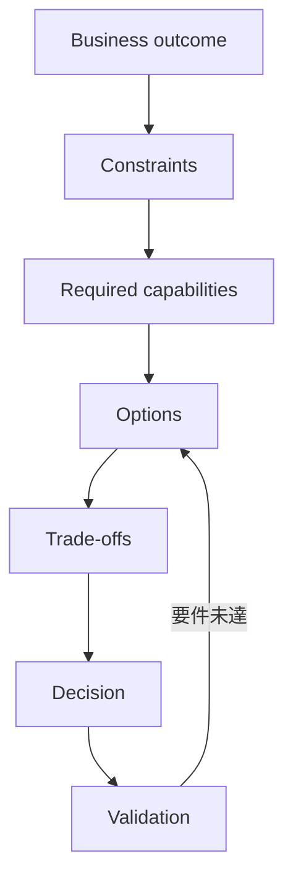
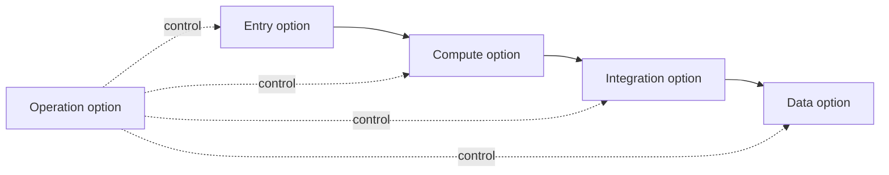
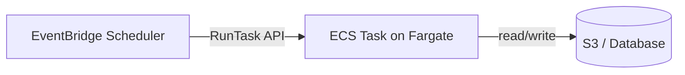

# 第2章 — 要件から設計を選ぶ

## 30秒要約

設計は、最も高機能なサービスを選ぶ作業ではない。

```text
目的
  → 制約
  → 候補
  → 比較
  → 決定
  → 不採用理由
```

同じ目的でも、停止時間、データ損失、運用人数、既存資産、予算が変われば正解は変わる。

---

# 最初の一枚



サービス名を考えるのは、Required capabilitiesを言葉にした後である。

---

# 1. 目的と手段を分ける

悪い要件：

> DynamoDBを使いたい。

良い要件：

> 世界中の利用者から高いRequest rateでKey-value dataを読み書きし、低Latencyを維持したい。複雑なJoinは不要である。

前者は手段を固定している。後者は候補を比較できる。

## 目的の書き方

```text
誰に:
何を提供する:
どの品質で:
どの制約の中で:
```

例：

```text
誰に: 日本と米国のMobile user
何を: 注文履歴の参照
品質: p95 300ms未満、Region障害時も継続
制約: 運用担当2名、既存SQL資産あり
```

この時点で、Global TablesだけでなくAurora Global DatabaseやRead model分離も候補になる。

---

# 2. 制約には強さがある

要件文のすべてを同じ重さで扱わない。

| 強さ | 例 | 扱い |
|---|---|---|
| Must | データ損失不可、既存IP変更不可 | 満たさない案は失格 |
| Strong preference | 最小運用、停止を極小化 | 正解を強く絞る |
| Preference | 可能なら安価 | 他条件を満たした後で比較 |
| Context | 現在EC2を利用 | 移行量や互換性へ影響 |
| Noise | 将来AIも検討 | 今回のDecisionへ直接影響しない場合がある |

## 強い制約語

- `must`
- `without changing`
- `minimum operational overhead`
- `least cost`
- `near-zero downtime`
- `no data loss`
- `fixed IP`
- `existing license`
- `regulatory`
- `within seconds`

制約語を見つけたら、候補を増やす前に失格条件を作る。

---

# 3. 非機能要件を数値へ変える

「高可用」「高速」「安い」だけでは比較できない。

## Availability

```text
許容停止時間:
障害単位: Instance / AZ / Region
Maintenance時の停止:
```

## Recovery

```text
RTO:
RPO:
復旧を自動化するか:
復旧テスト頻度:
```

## Performance

```text
平均 / Peak traffic:
p95 / p99 latency:
Read / write ratio:
Payload size:
Concurrency:
```

## Cost

```text
月額上限:
初期費用:
人件費を含むTCO:
Data transfer:
Commitment可能性:
```

## Operations

```text
担当人数:
24/7対応:
既存Skill:
Patch responsibility:
Release frequency:
```

数値がない場合も、選択肢間の相対比較へ使える形にする。

---

# 4. 候補は役割ごとに出す

一つのサービス名だけで全体設計を考えない。



例：Global Web applicationなら、次のように候補を分ける。

| 役割 | 候補 |
|---|---|
| Name / routing | Route 53 |
| Edge | CloudFront / Global Accelerator |
| Entry | ALB / API Gateway / NLB |
| Compute | ECS / EKS / Lambda / EC2 |
| State | Aurora / DynamoDB / S3 |
| Async | SQS / EventBridge / Step Functions |
| Recovery | Multi-AZ / Global DB / Backup / DRS |

「CloudFrontかAuroraか」のように役割の違うサービスを直接比較しない。

---

# 5. 比較軸を固定する

候補ごとに説明文を変えると、都合のよい比較になる。

同じ軸で比較する。

| 軸 | 問うこと |
|---|---|
| 要件適合 | Mustを満たすか |
| Failure behavior | 何が壊れ、どう切り替わるか |
| State | 正本、Replica、Cacheはどこか |
| Operations | Patch、Scaling、Backup、Upgradeの責任は誰か |
| Performance | Latency、Throughput、Concurrencyへ合うか |
| Security | Identity、Network、Encryption、Auditを満たすか |
| Cost | Fixed、Variable、Transfer、People costは何か |
| Migration | Code変更、Data同期、Cutoverが可能か |
| Reversibility | 戻せるか、Lock-inは許容できるか |

---

# 6. 「最小運用」を読み違えない

`minimum operational overhead`は、必ずLambdaを選ぶという意味ではない。

見るべきもの：

- OS管理
- Cluster管理
- Capacity planning
- Backup
- Failover
- Patch
- Upgrade
- Deployment
- Monitoring
- On-call complexity

長時間のContainer workloadなら、LambdaよりECS on Fargateの方が自然な場合がある。

Kubernetes要件がなければ、EKSは余分な運用面を増やす可能性がある。

## 比較例

| 条件 | 有力候補 | 理由 |
|---|---|---|
| 短時間Event処理 | Lambda | Server管理を減らせる |
| Containerを簡潔に運用 | ECS Fargate | Node管理を減らせる |
| Kubernetes APIが必須 | EKS | 互換性が要件 |
| 特殊OS・Driver | EC2 | 制御が必要 |

---

# 7. 「最小コスト」を読み違えない

最小コストは、単価が一番安いものではない。

```text
Infrastructure
+ Data transfer
+ License
+ Operations
+ Downtime risk
+ Migration
= Total cost
```

## 例

安いEC2を一台使う構成は、月額だけなら安い。

しかし、次を含めると結果が変わる。

- Patch作業
- Backup運用
- 障害対応
- Single Point of Failure
- 夜間On-call

Managed serviceは単価が高くても、TCOが低い場合がある。

一方で、要件が低いのにGlobal Active/Activeを採用するのは過剰設計である。

---

# 8. 「高可用」を読み違えない

高可用性は一つの機能ではない。

```text
Failure detection
  → Traffic isolation
  → Healthy capacity
  → State availability
  → Client reconnection
  → Business validation
```

Multi-AZにしただけでは、Application、Queue、DNS、Secret、External dependencyの障害は解決しない。

## Failure unitを先に決める

| 障害単位 | 代表的対策 |
|---|---|
| Process | Restart、Health check |
| Instance / Task | Auto Scaling、Desired count |
| AZ | Multi-AZ placement、Load Balancer |
| Region | Cross-Region data、Routing、DR |
| Account | Cross-account Backup、Central logging |
| Human error | Approval、Versioning、Rollback、Backup |

---

# 9. Shared VPCとTransit Gatewayの例

要件：

> 新規複数Account、単一Region、オンプレ接続、通信量は大きくない。コストと管理を抑えたい。

## 候補A — Transit Gateway

向く条件：

- 多数VPCを独立管理
- Hub routing
- Route table分離
- 複数VPN / DX統合

## 候補B — VPC Sharing

向く条件：

- Network accountがSubnetを中央管理
- Participant accountが同じVPCへResourceを配置
- VPC数を増やさず統制

## 判断

「複数Account」という一語だけでTGWを選ばない。

VPCが一つでよく、中央Network管理へ寄せられるなら、VPC Sharingの方が構成とCostを抑えられる可能性がある。

---

# 10. EventBridgeからECSを定刻起動する例

要件：

> 毎日決まった時刻にContainer batchを起動する。外部ClientへAPIを公開しない。



## API Gatewayが不要な理由

API Gatewayの中心役割は、Client向けAPIの公開・認証・Throttle・Request管理である。

この構成では、SchedulerがECS RunTaskを直接呼べる。HTTP APIを公開する要件がない。

API Gatewayを追加すると、解決していない問題に対して入口と運用対象を増やす。

## API Gatewayが必要になる条件

- 外部Clientが任意時刻に起動要求する
- Request認証やThrottleが必要
- API contractを公開する

---

# 11. Decision recordを書く

設計判断は図だけで残さない。

```markdown
## Decision
ECS on Fargateを採用する。

## Context
長時間Container batch。Kubernetes要件なし。運用担当2名。

## Constraints
OS管理を減らす。Peak時のみ起動。既存Container imageを利用。

## Alternatives
- EC2
- ECS on EC2
- EKS
- Lambda

## Why
FargateはNode管理を減らし、Container imageを維持できる。

## Why not others
- EC2: OS/Patch/Capacity管理が増える
- EKS: Kubernetes要件がなく運用面が増える
- Lambda: 実行特性が長時間処理に合わない

## Consequences
Task単位料金。Fargate制約を確認。Image起動時間を監視する。

## Validation
処理時間、Cost/job、Failure retry、Peak時の起動数を検証する。
```

良いDecision recordは、後から前提が変わったか判断できる。

---

# 12. 過剰設計を見抜く

次の兆候がある。

- RTO/RPOが不明なのにMulti-Region Active/Active
- Kubernetes要件がないのにEKS
- 二つのVPCしかないのに複雑なTGW設計
- 内部定期処理だけなのにAPI Gateway
- Read performance問題にBackup強化
- Connection枯渇にRead Replicaだけ追加
- Static contentにApplication serverを残す

高度なサービスを使うことと、良い設計は同じではない。

---

# 13. 不採用理由を作る

不採用理由は、サービスを否定する文章ではない。

悪い例：

> EKSは複雑だから使わない。

良い例：

> 既存Kubernetes資産、Kubernetes API、Operator利用の要件がない。一方で少人数運用が強い制約であるため、EKSが追加するCluster upgradeとAddon管理の責任が見合わない。

不採用理由には次を入れる。

- どの前提で
- どの比較軸が
- 要件に合わないか

---

# 確認問題

1. 目的と手段の違いを、自分の言葉で説明できるか。
2. MustとPreferenceを分けられるか。
3. 「高可用」をFailure detectionからBusiness validationまで展開できるか。
4. 「最小運用」でLambdaを自動選択してはいけない理由は何か。
5. TCOに含める項目を五つ挙げられるか。
6. Shared VPCとTGWをAccount数だけで選んではいけない理由は何か。
7. EventBridge→ECSでAPI Gatewayが不要になる条件は何か。
8. 採用理由と不採用理由を同じ比較軸で書けるか。

次は、選んだ設計が壊れたときの動きを読む。[第3章](03-failure-recovery.md)へ進む。
