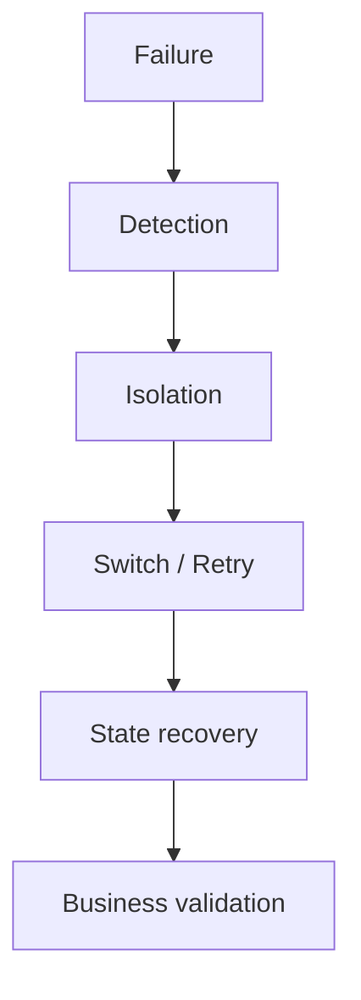
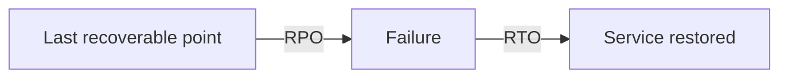
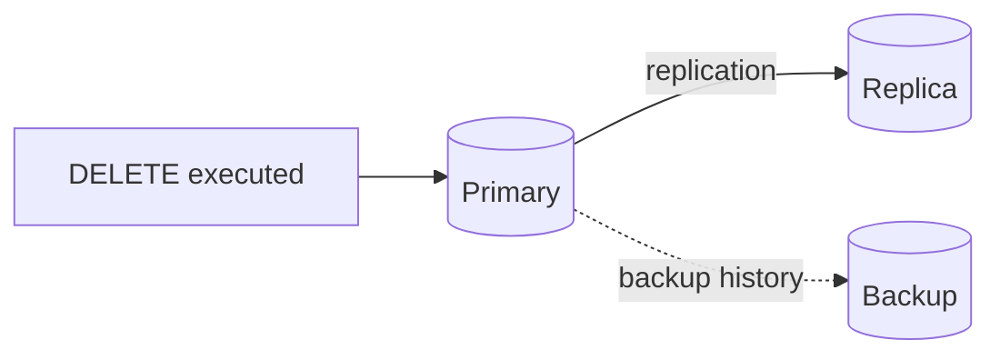
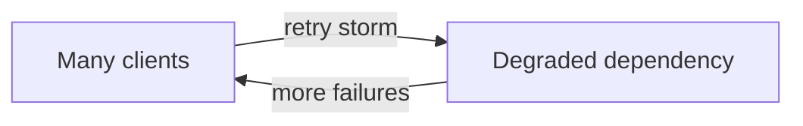
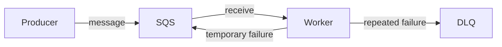
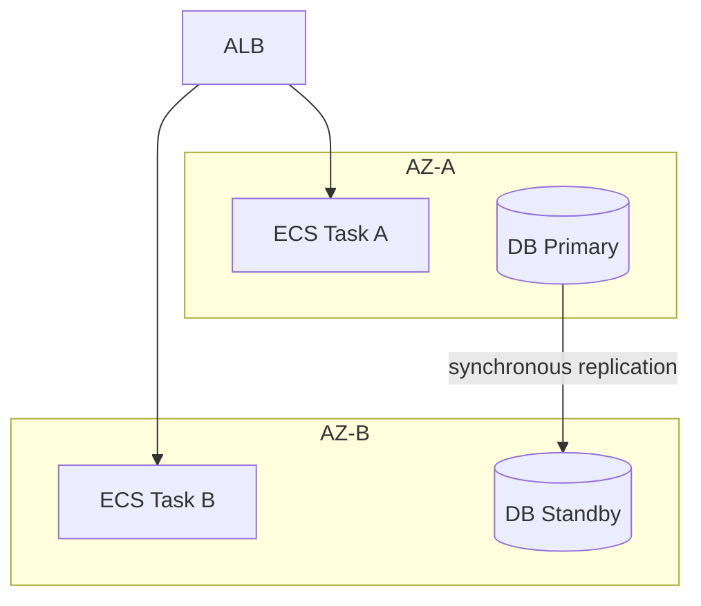
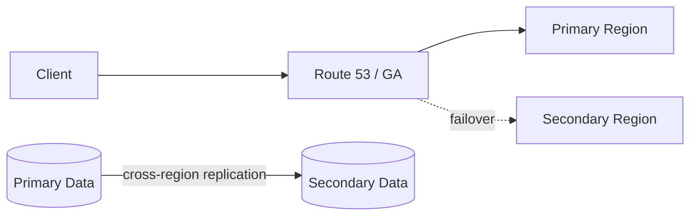
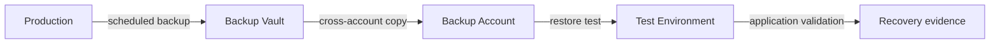

# 第3章 — どこが壊れ、どう回復するか

## 30秒要約

障害対策は、Resourceを二つに増やすことではない。

```text
障害を定義する
  → 検知する
  → 影響を隔離する
  → 正常系へ切り替える
  → 状態を回復する
  → 利用者視点で確認する
```

高可用性、Replica、Backup、DRは役割が違う。

---

# 最初の一枚



どこか一つが欠けると、「冗長化しているのに復旧しない」が起きる。

---

# 1. 何が壊れるかを先に決める

「障害に強くする」では広すぎる。

| Failure unit | 例 |
|---|---|
| Process | Application crash、Memory leak |
| Task / Instance | EC2停止、ECS Task異常 |
| Dependency | DB、External API、DNS |
| AZ | 電源・Networkの局所障害 |
| Region | 広域障害 |
| Account | 誤設定、Credential compromise |
| Data | 誤削除、論理破損、Ransomware |
| Human / Process | 手順ミス、担当者不在 |

対策はFailure unitごとに変わる。

---

# 2. 可用性と復旧を分ける

## High availability

障害中もServiceを続ける。

例：

- ALBがUnhealthy targetを外す
- Auto ScalingがInstanceを置換する
- RDS Multi-AZがStandbyへFailoverする

## Recovery

停止後にServiceを戻す。

例：

- SnapshotからRestore
- DRSでRecovery siteを起動
- Backupから別Accountへ復元

## Disaster recovery

大規模障害を想定し、別Environmentへ業務を戻す。

HAがあるからBackup不要、BackupがあるからHA不要、ではない。

---

# 3. RTOとRPO

- **RTO**: どれだけの時間で戻すか
- **RPO**: どれだけのData lossを許容するか



## 例

```text
RPO 15分
RTO 1時間
```

意味：

- 最大15分分のData lossを許容
- 障害発生から1時間以内にService復旧

この数値がないまま、Active/Activeを選ばない。

---

# 4. Multi-AZ、Read Replica、Backupの違い

| 仕組み | 主目的 | 現在状態を追従 | 過去へ戻る |
|---|---|---:|---:|
| Multi-AZ | 可用性 | Yes | No |
| Read Replica | Read scale / DR補助 | Yes | No |
| Backup / Snapshot | Point-in-time recovery | No | Yes |

## 誤削除の例



Replicaは誤削除も追従する可能性がある。過去へ戻るにはBackupが必要である。

---

# 5. Retryは安全装置ではない

Retryは一時障害から回復するために使う。

しかし、無制限Retryは障害を増幅する。



必要なもの：

- Timeout
- Maximum attempts
- Exponential backoff
- Jitter
- Idempotency
- DLQまたは失敗記録

## Idempotency

同じ要求が複数回来ても、Business effectを一度に保つ。

```text
Payment request ID: order-123
1回目: 決済実行
2回目: 既存結果を返す
```

SQS Standard、Lambda retry、Network timeoutがある構成では重要である。

---

# 6. Partial failureを考える

分散Systemでは、全成功・全失敗だけではない。

```text
注文保存: 成功
決済: 成功
在庫引当: 失敗
Email: 未実行
```

## 対策

- Step Functionsで状態管理
- Compensation
- Saga pattern
- Outbox pattern
- Event log
- Reconciliation job

「Requestが200を返した」だけで、Business process全体が完了したとは限らない。

---

# 7. Queueを使った障害隔離



Queueが提供すること：

- ProducerとWorkerの時間分離
- Peak吸収
- Retryの独立
- Failure itemの隔離

Queueが自動的に提供しないこと：

- Business重複排除
- 無限保持
- 正しい処理順序
- Data整合性
- DLQ後の復旧手順

DLQは墓場ではない。Owner、Alarm、Replay手順が必要である。

---

# 8. AZ障害

代表的なWeb構成：



確認する：

- Application targetが複数AZにあるか
- Capacityが片AZ喪失後も足りるか
- DBがFailoverできるか
- NAT Gatewayなど出口がAZごとにあるか
- AZ間Data transferとLatencyを理解しているか
- Clientが再接続できるか

配置しただけでCapacityが保証されるわけではない。

---

# 9. Region障害

Region DRは、Computeを別Regionに置くだけでは完成しない。



必要な要素：

- Traffic切替
- Secondary capacity
- Data replication / restore
- Secret / KMS / IAM
- Configuration / Artifact
- Dependency
- Runbook
- Failover test
- Failback

## DR戦略

| 戦略 | Cost | RTO目安 | 概要 |
|---|---:|---:|---|
| Backup & Restore | 低 | 長 | 必要時に再構築 |
| Pilot Light | 低〜中 | 中〜長 | Dataと中核のみ常時 |
| Warm Standby | 中〜高 | 短 | 縮小版を常時稼働 |
| Active/Active | 高 | 最短 | 両Regionで処理 |

最も高価な戦略が常に正解ではない。

---

# 10. Data recovery

Backup設計は「取得する」で終わらない。



確認する：

- Backup頻度がRPOを満たすか
- Restore時間がRTOを満たすか
- KMS keyへRecovery accountがAccessできるか
- Cross-account / Cross-Region copyがあるか
- Vault deletion protectionがあるか
- Application dependency順序を復元できるか
- 定期Restore testをしているか

Backup成功Notificationだけでは、復元可能性を証明できない。

---

# 11. DetectionとBusiness validation

InfrastructureがHealthyでも、Businessは壊れている場合がある。

例：

- ALB health checkは200
- Application processも起動
- しかしPayment provider接続が失敗
- Checkoutは完了しない

## 二段階確認

```text
Technical health:
CPU、Process、Port、DB connection

Business health:
Login、Search、Checkout、File upload
```

Failover後はBusiness transactionを確認する。

---

# 12. Failure mode tableを作る

| Failure | Detection | Automatic action | Manual action | Verification |
|---|---|---|---|---|
| ECS Task crash | Target health | Task replacement | 原因調査 | API canary |
| DB failover | RDS event | Standby promotion | Connection確認 | Read/write test |
| Queue backlog | Age alarm | Worker scale | Poison message調査 | Age低下 |
| Region outage | Health check | Traffic switch | DR command | Business journey |
| Accidental delete | Audit / user report | None | PITR / restore | Data reconciliation |

この表がないと、サービスを並べただけのDRになる。

---

# 確認問題

1. HA、Backup、DRの違いを説明できるか。
2. Multi-AZとRead Replicaの主目的を分けられるか。
3. RetryにBackoff、Jitter、Idempotencyが必要な理由は何か。
4. DLQへ入った後、誰が何をするか説明できるか。
5. AZ障害後にCapacity不足が起こる理由は何か。
6. Region DRでData以外に複製・準備すべきものを五つ挙げられるか。
7. Backup successとRestore successの違いは何か。
8. Technical healthとBusiness healthを分けられるか。

次は、障害が起きる前にどう観測し、安全に変更するかを読む。[第4章](04-operation-change.md)へ進む。
