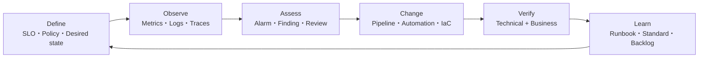
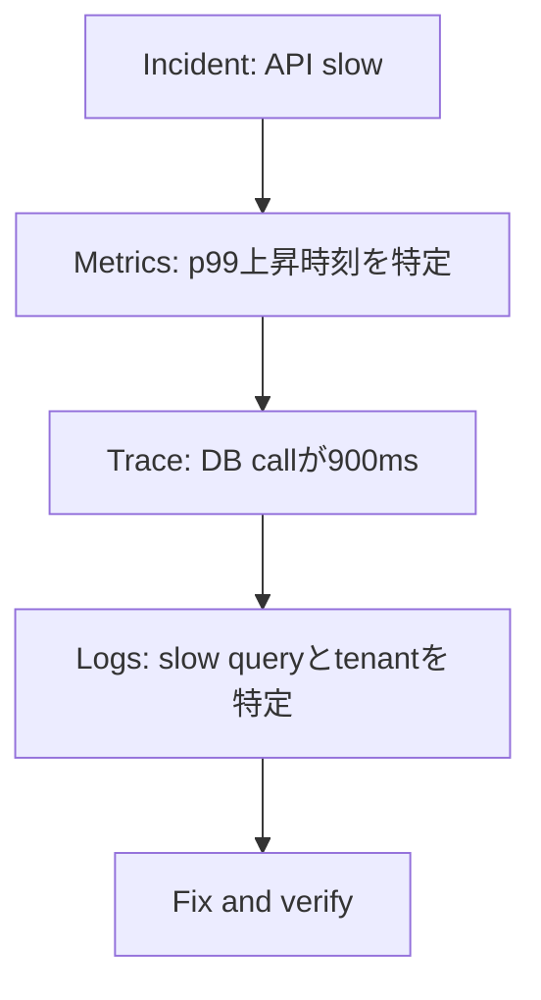
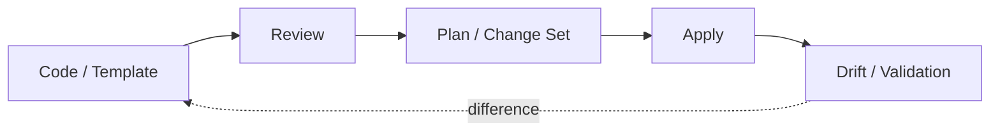
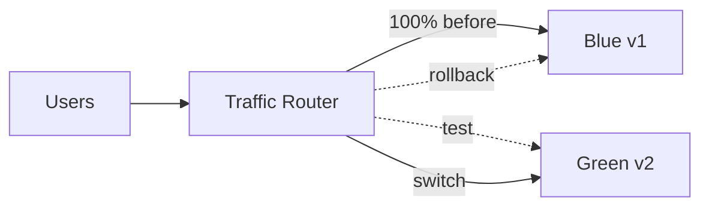
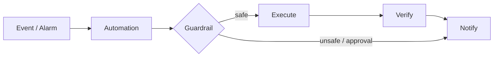
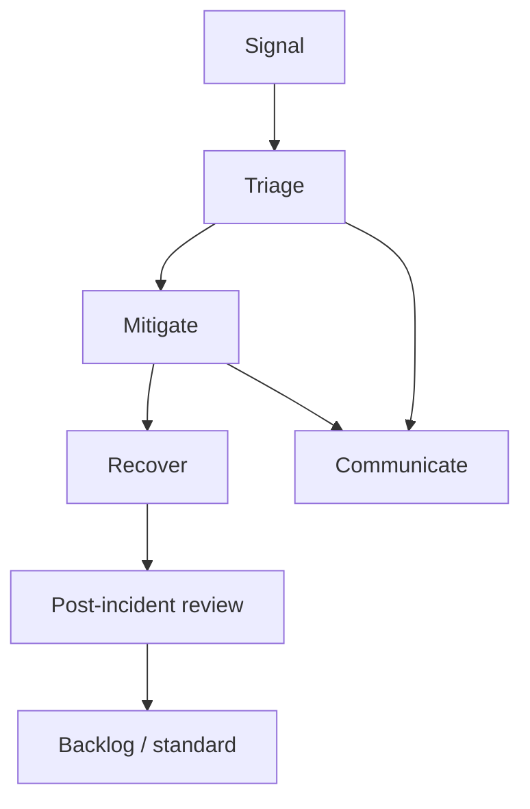

# 第4章 — どう観測し、安全に変更するか

## 30秒要約

運用は、Alarmが鳴った後に担当者がConsoleを見ることではない。

```text
望ましい状態を定義する
  → 観測する
  → 変化を検知する
  → 判断する
  → 安全に変更する
  → 結果を検証する
  → 学びを標準化する
```

Metrics、Logs、Traces、Config、IaC、Pipeline、Runbookは、この循環の別々の部分を担当する。

---

# 最初の一枚



運用は一方向ではなく、学びを次の設計へ戻すLoopである。

---

# 1. まず「正常」を定義する

監視項目を増やす前に、利用者にとっての正常を決める。

## Business outcome

- Loginできる
- 商品検索できる
- 注文できる
- FileをUploadできる
- Batchが締切までに完了する

## Technical condition

- Error rate
- Latency
- Queue age
- Replication lag
- Connection usage
- Capacity

## 例

```text
Business SLO:
30日間でCheckout成功率99.9%以上

Technical indicators:
p95 < 500ms
5xx < 0.1%
Payment dependency error < 0.05%
Queue oldest age < 60秒
```

CPUが低いことはBusiness成功を保証しない。

---

# 2. Metrics、Logs、Tracesを分ける

| 種類 | 答えやすい問い | 例 |
|---|---|---|
| Metrics | いつ、どれくらい悪化したか | Error rate、Latency、CPU、Queue age |
| Logs | 何が起きたか | Error message、Request ID、Decision |
| Traces | どこで時間を使ったか | Service間Latency、Dependency |



一種類だけで全てを解こうとしない。

---

# 3. 良いAlarmはActionを持つ

悪いAlarm：

> CPUが80%を超えた。

良いAlarm：

> Checkout APIのp95が5分間1秒を超え、5xxも上昇している。利用者影響がある。DashboardとRunbookを開き、ALB→ECS→DBの順に確認する。

## Alarmに含める

- What happened
- User impact
- Scope
- Owner
- First action
- Dashboard
- Runbook
- Escalation

## Signalの選び方

| Workload | 良いSignal |
|---|---|
| Web API | Request、Error、Latency、Saturation |
| Queue worker | Queue depthよりAge、Arrival rate、Processing rate |
| Database | Connection、Lock、Latency、Replica lag |
| Batch | Completion deadline、Failure、Duration |
| Stream | Consumer lag、Iterator age、Delivery failure |

CPUだけでScalingやIncidentを決めない。

---

# 4. Control planeとData planeを分ける

## Data plane

利用者の実処理。

- S3 object read/write
- DynamoDB item operation
- Application request
- SQS message processing

## Control plane

構成を管理する操作。

- CreateBucket
- UpdateSecurityGroup
- ChangeRoute
- DeployService
- ModifyDBInstance

CloudTrailは主にAPI操作のAuditへ使う。Application logや全Data accessの代わりではない。

ConfigはResource configurationとComplianceを追う。CloudTrailと役割を混同しない。

---

# 5. Desired stateをCodeにする

Manual changeは、現在状態が分かりにくく、再現とReviewが難しい。



IaCの価値：

- Review可能
- 再現可能
- Version管理
- Environment差分を減らす
- Rollback材料
- Audit

IaCを使っていても、Database schemaやApplication dataのRollbackは別に設計する。

---

# 6. Deployment戦略を選ぶ

| 戦略 | 切替 | Risk | Cost | 向く場面 |
|---|---|---:|---:|---|
| All-at-once | 全置換 | 高 | 低 | Dev、短い停止許容 |
| Rolling | 一部ずつ | 中 | 低〜中 | Capacityを保ちながら更新 |
| Immutable | 新環境へ置換 | 低〜中 | 中 | Environment差異を減らす |
| Blue/Green | 新旧環境を切替 | 低 | 高 | 高速Rollback、検証 |
| Canary | 少量Trafficから | 低 | 中 | Production behaviorを段階検証 |
| Linear | 一定割合ずつ | 低 | 中 | Controlled rollout |

## 図：Blue/Green



## Rollbackの種類

- Traffic rollback
- Application artifact rollback
- Configuration rollback
- Infrastructure rollback
- Database rollback

Trafficを旧版へ戻せても、非互換Schema変更後は旧版が動かない可能性がある。

---

# 7. Database変更は前後互換で考える

安全な流れの例：

```text
1. 新旧Applicationが読めるColumnを追加
2. 新版をDeploy
3. DataをBackfill
4. Read pathを切替
5. 旧版を停止
6. 古いColumnを後日削除
```

Expand and contract patternである。

危険な例：

```text
Deploy前に既存ColumnをRename / Delete
```

旧Applicationが即座に壊れる。

---

# 8. ConfigurationとSecretを分ける

## Configuration

- Feature flag
- Timeout
- Endpoint
- Runtime parameter

候補：AppConfig、Parameter Storeなど。

## Secret

- Password
- API key
- Token
- Private credential

候補：Secrets Managerなど。

SecretをSource codeやEnvironment fileへ固定しない。

Configuration変更はApplication deployより速く影響する場合があるため、ValidationとRollbackが必要である。

---

# 9. Automationは安全性まで設計する



安全策：

- Scope limit
- Idempotency
- Maximum retry
- Dry-run
- Approval
- Audit log
- Timeout
- Rollback
- Post-check

「自動化できる」と「無条件に自動実行してよい」は別である。

---

# 10. RunbookとPlaybook

## Runbook

特定操作の手順。

```text
RDS storage emergency expansion
1. Current usage確認
2. Growth rate確認
3. Change実行
4. Application確認
5. Root cause ticket作成
```

## Playbook

状況を切り分ける判断体系。

```text
API latency
  → Edge
  → Entry
  → Compute
  → Dependency
  → Data
```

Runbookは操作を標準化し、Playbookは判断を標準化する。

---

# 11. Incidentの流れ



## Triage

- User impact
- Scope
- Changeとの相関
- Dependency
- Data risk

## Mitigate

Root causeを完全に理解する前でも、影響を減らす。

- Rollback
- Scale
- Traffic shift
- Feature disable
- Dependency bypass

## Post-incident review

人を責めるのではなく、SystemとProcessを改善する。

- なぜ検知が遅れたか
- なぜ影響が広がったか
- なぜ復旧が難しかったか
- どのGuardrailが不足したか

---

# 12. Continuous improvement

改善は一回のProjectではない。

```text
Observe
  → measurable problem
Diagnose
  → evidence-based cause
Change
  → small reversible step
Verify
  → SLO / KPI / Cost
Standardize
  → IaC / Runbook / Guardrail
```

## 改善前後で比較する

- p95 / p99
- Error rate
- Queue age
- Deployment frequency
- Change failure rate
- MTTR
- Cost per transaction
- Manual hours
- Restore time

「新しいサービスを導入した」は成果指標ではない。

---

# 13. Game DayとRestore test

## Game Day

仮説を立てて障害を注入または模擬する。

```text
Hypothesis:
AZ-Aを失ってもCheckout SLOを維持できる

Observe:
Capacity、DB failover、Queue、User journey

Abort condition:
Data integrity risk、Error budget超過
```

## Restore test

Backupから復元し、Applicationとして使えることを確認する。

Backup job成功とRestore成功は別である。

---

# 確認問題

1. SLOとMetricの違いを説明できるか。
2. Metrics、Logs、Tracesが答える問いを分けられるか。
3. CloudTrailとConfigの役割を分けられるか。
4. Blue/GreenでTrafficを戻してもRollbackできないケースは何か。
5. Database schema変更で前後互換が必要な理由は何か。
6. Automationへ必要なGuardrailを五つ挙げられるか。
7. RunbookとPlaybookの違いは何か。
8. 「サービス導入」ではなく「改善」を測る指標を挙げられるか。

次は既存環境をAWSへ動かすときの時間軸を読む。[第5章](05-migration-modernization.md)へ進む。
