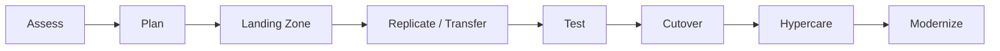
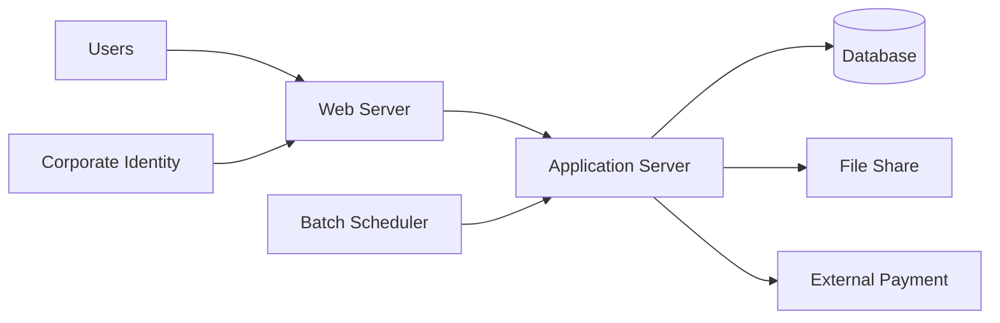
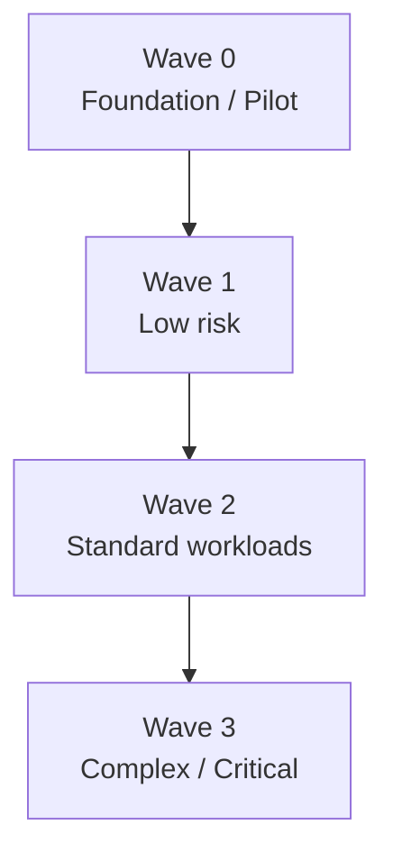
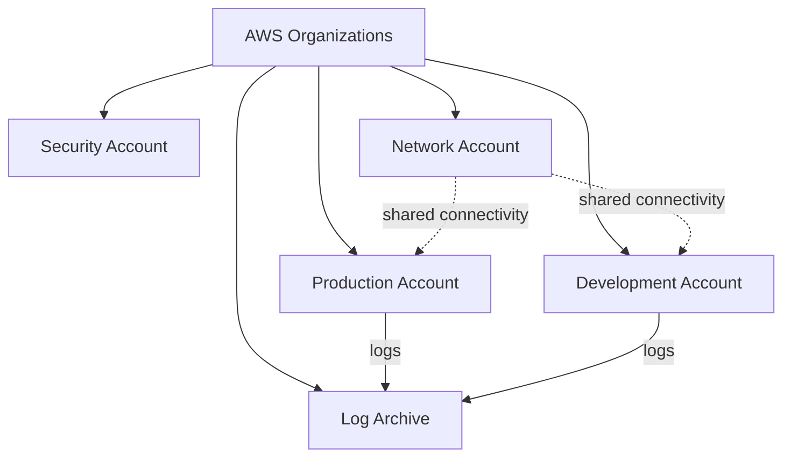
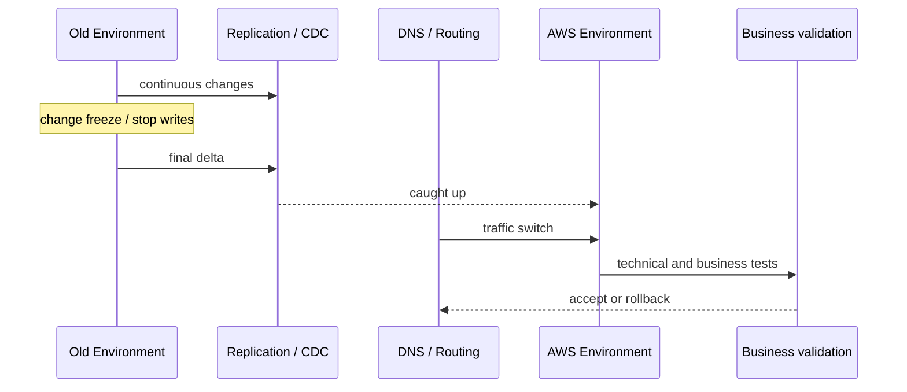
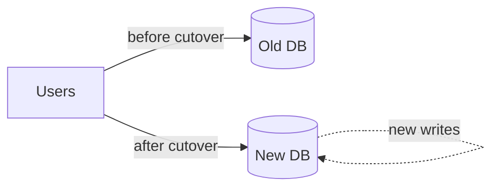

# 第5章 — 既存環境をどう移し、変えるか

## 30秒要約

Migrationは、DataをコピーしてServerを起動する作業ではない。

```text
発見する
  → 依存関係を理解する
  → 移行戦略を決める
  → 基盤を準備する
  → 継続同期する
  → Testする
  → Cutoverする
  → 安定化する
  → Modernizeする
```

MGN、DMS、DataSync、Snow Familyは、この時間軸の一部を担当する。

---

# 最初の一枚



Migration toolを選ぶ前に、どの段階の問題かを確認する。

---

# 1. Portfolio、Workload、Componentを分ける

## Portfolio

企業全体のApplication群。

- 何を廃止するか
- 何を残すか
- どの順番で移すか
- CostとRiskはどうか

## Workload

一つの業務System。

- Web
- Application
- Database
- File
- Batch
- External interface

## Component

移行対象の技術要素。

- Server
- DB
- File share
- Network
- Identity
- Job scheduler

DMSでServer移行をしようとする、DataSyncでDBを移そうとする誤りは、対象レイヤーの混同から起きる。

---

# 2. 最初に依存関係を描く



Server一覧だけでは不足する。

確認する：

- Port / Protocol
- DNS name
- Authentication
- Shared file
- Scheduled job
- Certificate
- License
- Data volume / change rate
- External party
- Business calendar

依存関係を見ずにWaveを作ると、移行後に一部だけ旧環境へ残る。

---

# 3. 7Rを選ぶ

| Strategy | 意味 | 主な判断 |
|---|---|---|
| Retire | 廃止 | 利用されていない、代替済み |
| Retain | 維持 | 今は移せない、Riskが高い |
| Rehost | ほぼそのまま移す | 速度、Code変更最小 |
| Relocate | 基盤単位で移す | VMwareなどを大きく変えない |
| Replatform | 一部Managed化 | 変更を抑えつつ運用削減 |
| Repurchase | SaaS等へ置換 | Product変更を受け入れる |
| Refactor | 再設計 | Cloud特性を最大活用 |

## 7Rは優劣ではない

Refactorが最も進んでいるように見えるが、期限が短い場合はRiskが高い。

よくある段階案：

```text
Phase 1: RehostでData center exit
Phase 2: Stabilize
Phase 3: Replatform / Refactor
```

Migration deadlineとModernizationを分ける。

---

# 4. Wave Planning

全Systemを一度に移さない。



## Waveを決める軸

- Business criticality
- Dependency
- Complexity
- Data volume
- Downtime window
- Team readiness
- Compliance
- Vendor support
- Learning value

最初のWaveは、簡単すぎて学びがないものでも、重要すぎて失敗できないものでもない。

---

# 5. Landing Zoneを先に準備する

移行先Accountを作るだけではない。

- Organizations / OU
- IAM Identity Center
- Network connectivity
- DNS
- Logging
- Guardrails
- KMS
- Backup
- Monitoring
- Tagging
- Cost allocation
- Incident access



Workloadを先に移し、後からLoggingやBackupを追加すると、統制の空白が生まれる。

---

# 6. 対象ごとに移行手段を選ぶ

## Server

### Application Migration Service

Block-level replicationを使い、Serverを継続同期してRehostを支援する。

向く条件：

- Code変更を抑える
- Cutover停止を短くする
- Server単位で移す

## Database

### DMS

Data移行とCDCを行う。

### Schema Conversion

異種Engine間のSchemaやCode変換を支援する。

DMSだけでStored procedureやApplication SQLが完全に変換されるとは限らない。

## File / Object

### DataSync

Network経由のOnline transferと差分同期。

### Snow Family

回線では期限に間に合わない大容量DataのOffline transfer。

### Transfer Family

SFTP / FTPS / FTP / AS2 interfaceをManaged化する。

## 選択表

| 対象 | 主な候補 |
|---|---|
| Server / OS disk | MGN |
| Relational DB data | DMS |
| Heterogeneous schema | Schema Conversion |
| NFS / SMB / Object transfer | DataSync |
| Offline large data | Snow Family |
| Existing SFTP interface | Transfer Family |

---

# 7. Data transfer時間を計算する

概算：

```text
Transfer time ≒ Data size / Effective throughput
```

実効ThroughputはLink帯域より小さい。

考慮する：

- Protocol overhead
- Encryption
- Small file overhead
- Source disk speed
- Network congestion
- Change rate
- Retry

## Change rate

初回Copy中もDataが増える。

```text
Initial backlog 10 TB
Transfer 1 TB/day
Daily change 0.4 TB/day
Net catch-up 0.6 TB/day
```

差分へ追いつけるか確認する。

---

# 8. Test migration

Testは「Serverが起動した」で終わらない。

## Technical

- Boot
- Network
- DNS
- IAM
- Certificate
- Storage
- DB connection
- Monitoring

## Functional

- Login
- Core transaction
- Batch
- Report
- External interface

## Non-functional

- Performance
- Recovery
- Security
- Backup / Restore
- Operations

## Business

- User acceptance
- Reconciliation
- Compliance evidence

---

# 9. Cutover plan



## Cutover checklist

- Change freeze
- Final backup
- Final delta
- Replication lag zero / acceptable
- DNS TTL preparation
- Traffic switch
- Smoke test
- Business validation
- Reconciliation
- Communication
- Rollback deadline

---

# 10. RollbackとData divergence

Trafficを旧環境へ戻すだけなら簡単に見える。

しかし、新環境でWriteが始まるとDataが分岐する。



Rollback時に決める：

- 新環境のWriteを旧環境へ戻すか
- Dataを破棄できるか
- 双方向同期が必要か
- どの時点までRollback可能か

Rollback可能時間を明記する。

---

# 11. Hypercare

Cutover直後は通常運用へすぐ戻さない。

監視する：

- Error
- Latency
- Resource saturation
- Data reconciliation
- Batch completion
- User inquiry
- Cost anomaly
- Backup
- Security finding

OwnerとEscalationを明確にする。

終了条件：

- SLO安定
- Critical defectなし
- Data差異なし
- Runbook整備
- Operations handover完了

---

# 12. Modernization

Migration後に何を改善するかは、Observed painから決める。

| Pain | Modernization候補 |
|---|---|
| OS/Patch負荷 | Managed DB、Fargate、Serverless |
| Scale困難 | Auto Scaling、Queue、Stateless化 |
| Releaseが遅い | CI/CD、IaC、Blue/Green |
| DB接続枯渇 | RDS Proxy、Connection管理 |
| Static配信負荷 | S3 + CloudFront |
| Tight coupling | EventBridge、SQS、Step Functions |
| 高いStorage cost | Lifecycle、Class最適化 |

サービスありきではなく、Migration後に測定した問題へ適用する。

---

# 13. Migration decision record

```text
Workload:
Business owner:
Criticality:
Dependencies:
Current pain:
Target outcome:
7R:
Migration tools:
Data sync:
Downtime:
RTO / RPO during migration:
Test evidence:
Cutover trigger:
Rollback deadline:
Hypercare exit:
Modernization backlog:
```

---

# 確認問題

1. Portfolio、Workload、Componentを分けられるか。
2. 7Rを成熟度の順位として扱ってはいけない理由は何か。
3. Wave 0へ適したWorkloadの特徴は何か。
4. Landing ZoneをWorkload移行前に作る理由は何か。
5. MGN、DMS、DataSync、Snow Familyの対象を分けられるか。
6. Initial copy速度だけでなくChange rateを見る理由は何か。
7. Traffic rollbackとData rollbackの違いは何か。
8. Hypercareの終了条件を説明できるか。
9. Rehost後のModernizationをサービス一覧から決めてはいけない理由は何か。

次は、これまでの視点をSAP-C02の長文問題へ適用する。[第6章](06-sap-exam.md)へ進む。
