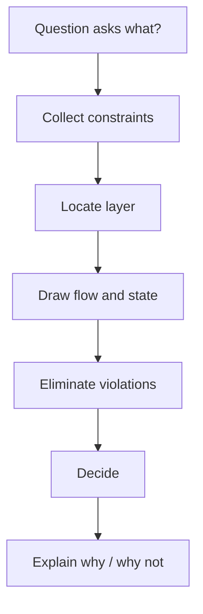
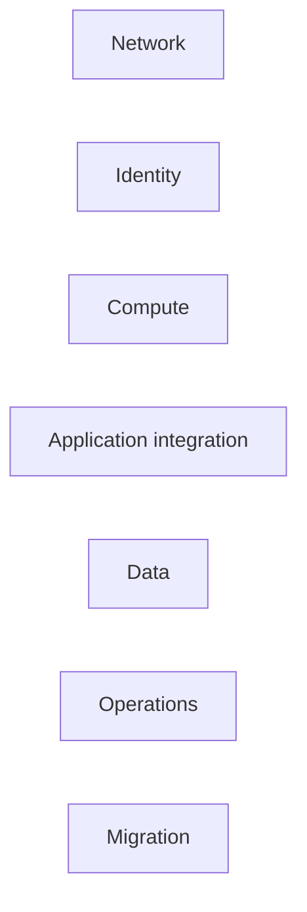
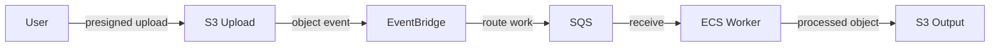

# 第6章 — SAP-C02の長文をどう読むか

## 30秒要約

SAP-C02は、知っているサービスを探す試験ではない。

```text
最後の質問を読む
  → 強い制約を拾う
  → 対象レイヤーを決める
  → Data flowを描く
  → 失格条件で選択肢を落とす
  → 採用理由と不採用理由を書く
```

正解の理由だけでなく、他の選択肢がなぜ要件に合わないかを説明できる状態を目指す。

---

# 最初の一枚



---

# 1. 最後の一文を先に読む

問題文を最初から均等に読むと、情報量に埋もれる。

先に確認する：

- `MOST cost-effective`
- `LEAST operational overhead`
- `MINIMIZE downtime`
- `MEET the recovery requirements`
- `MOST secure`
- `Which combination`
- `Select TWO / THREE`

同じ構成でも評価軸が違えば正解が変わる。

---

# 2. 問題文を五色に分ける

実際に色を付けなくても、頭の中で分類する。

| 種類 | 内容 | 例 |
|---|---|---|
| Current | 現在構成 | On-prem、Single AZ、Manual |
| Goal | 実現したいこと | Global、HA、Migration |
| Must | 絶対条件 | No code change、No data loss |
| Preference | 評価軸 | Least cost、Minimum operations |
| Evidence | 数値・事実 | 20 TB、40 Mbps、RTO 1h |

サービス名は、分類後に見る。

---

# 3. 強い制約語を拾う

| 問題文 | 読み替え |
|---|---|
| Existing application cannot be modified | Rehost / compatible interfaceを優先 |
| Near-zero downtime | Continuous replication、CDC、段階Cutover |
| No internet exposure | Private connectivity、Endpoint、DX/VPN |
| Fixed IP required | NLB、Global Accelerator、EIP等 |
| Minimum operations | Managed / Serverless。ただしWorkload適合を確認 |
| Strict ordering | FIFO、Partition strategy、Workflow |
| Multiple subscribers | Event routing / Fanout |
| Recover within minutes | Warm standby以上を検討 |
| No data loss | 同期性、Application consistencyを確認 |

強い制約を満たさない選択肢は、他が魅力的でも落とす。

---

# 4. 対象レイヤーを決める



問題がどの層を聞いているか決める。

## 例

```text
Server移行        → MGN
Database移行      → DMS / Schema Conversion
File移行          → DataSync
Private service公開 → PrivateLink
VPC間接続         → Peering / TGW
API管理           → API Gateway
Work buffer       → SQS
Event routing     → EventBridge
State workflow    → Step Functions
```

対象を誤ると、強力だが役割違いのサービスを選ぶ。

---

# 5. 短いData flowを描く

長文を次の形へ圧縮する。

```text
Client
  → Entry
  → Compute
  → Integration
  → Data
  → Recovery / Operations
```

## 例：動画処理



図を描くと、API Gatewayを動画本体の中継に使う必要がないことや、EventBridgeだけではWork bufferにならないことが見える。

---

# 6. Dataの正本を指す

問題でDataが出たら、次を確認する。

- Source of truth
- Replica
- Cache
- Backup
- Temporary work
- Audit record

## 例

```text
Order source of truth: Aurora
Session: ElastiCache
Pending fulfillment: SQS
Static receipt: S3
Backup: AWS Backup vault
```

Read ReplicaをBackupとして扱う、Cacheを正本として扱う誤答を落としやすくなる。

---

# 7. 選択肢は失格条件で落とす

正解らしさを探すより、要件違反を探す。

## 失格条件

- Mustを満たさない
- 対象レイヤーが違う
- Protocolが違う
- RTO/RPOへ届かない
- Code変更が必要
- 運用責任が増えすぎる
- Cost条件へ反する
- Public exposureが生じる
- Data consistencyを満たさない
- 一部要件しか解かない

## 選択肢評価テンプレート

```text
この選択肢は [対象] に [サービス] を使う。
[要件] は満たす / 満たさない。
理由は、[サービスの本来の役割] が [役割] だからである。
ただし、[不足する要素] には [別の仕組み] が必要である。
```

---

# 8. 複数正解問題

複数正解では、正しい文をすべて選ぶのではない。

設問が求める**最小の組み合わせ**を選ぶ。

## 例

要件：

- Eventを複数処理へ振り分ける
- WorkerをRetryとDLQで保護する
- 複雑な補償処理を行う

候補：

- EventBridge
- SQS
- Step Functions
- SNS

中核は次になる。

```text
Event routing   → EventBridge
Durable work    → SQS
Orchestration   → Step Functions
```

SNSもFanoutには正しいが、設問の中心要件を構成する必須要素かを確認する。

---

# 9. 「最小運用」の問題

確認順：

1. Workload制約を満たすか
2. Managed化できるか
3. Capacity managementを減らせるか
4. Upgrade / Patch責任を減らせるか
5. 追加の専門Skillが必要か

## 典型誤答

- Kubernetes要件がないのにEKS
- 短いEvent処理なのにEC2 clusterを常時運用
- Container長時間処理なのにLambdaを無理に使う
- Schedulerから直接ECSを起動できるのにAPI Gatewayを追加

---

# 10. Network問題

次の順に描く。

```text
名前解決
  → Source
  → Route
  → Gateway / Endpoint
  → Security control
  → Destination
  → Return path
```

## 混同しやすいもの

| 選択 | 主目的 |
|---|---|
| Peering | VPC同士の直接IP接続 |
| Transit Gateway | 多数NetworkのHub routing |
| PrivateLink | 特定ServiceだけPrivate公開 |
| Direct Connect | 専用Network接続 |
| VPN | Internet上の暗号化Tunnel |
| Route 53 Resolver | Hybrid DNS forwarding |

ConnectivityとDNSは別に成立させる。

---

# 11. Identity問題

三つに分ける。

```text
Authentication: 誰か
Authorization: 何をしてよいか
Credential: どう証明するか
```

さらにBoundaryを見る。

```text
Identity policy
Resource policy
SCP
Permission boundary
Session policy
KMS key policy
```

SCPは権限を付与しない。IAM Allowがあっても最大範囲を制限する。

Human access、Workload access、Application user authenticationを混同しない。

---

# 12. DR問題

最初にRTO/RPOとCostを抜き出す。

| Strategy | RTO | Cost |
|---|---:|---:|
| Backup & Restore | 長 | 低 |
| Pilot Light | 中長 | 低〜中 |
| Warm Standby | 中短 | 中〜高 |
| Active/Active | 最短 | 高 |

## 確認する要素

- Traffic switch
- Compute capacity
- Data
- Identity / Secret / KMS
- Configuration
- Test
- Failback

Aurora Global DatabaseだけでApplication全体のDRが完成するわけではない。

---

# 13. Migration問題

対象を先に決める。

| 対象 | 候補 |
|---|---|
| Server | MGN |
| DB data | DMS |
| Heterogeneous schema | Schema Conversion |
| File | DataSync |
| Offline large data | Snow Family |
| SFTP interface | Transfer Family |

次に確認する。

- Data量
- Change rate
- Bandwidth
- Downtime
- Cutover
- Rollback
- Code change

---

# 14. Cost問題

単価だけを比べない。

```text
Compute
+ Storage
+ Request
+ Data transfer
+ NAT / Endpoint
+ License
+ Operations
+ Commitment
```

## 順序

```text
Visibility
  → Remove waste
  → Rightsize
  → Architecture optimize
  → Commitment
```

過剰ResourceのままSavings Plansを買う選択肢に注意する。

---

# 15. 誤答パターン集

- SCPで権限を与える
- Read ReplicaをBackupにする
- CloudFrontでDBを高速化する
- PrivateLinkでVPC全体を接続する
- Direct Connectを自動暗号化と考える
- Security GroupをStatelessと考える
- EventBridgeを長期Work queueとして使う
- RDS ProxyでQuery結果をCacheする
- KMS暗号化で列レベル認可を代替する
- DataSyncでDB CDCを行う
- Snow Familyで継続差分同期する
- API Gatewayを内部Scheduler呼び出しへ無条件に置く
- Multi-Regionを要件数値なしで選ぶ

---

# 16. 一問を解くメモ

```text
【最後の質問】
何を最適化するか:
正解数:

【現状】

【Must】

【Preference】

【対象レイヤー】

【Flow】

【State / source of truth】

【候補】
A:
B:
C:

【失格理由】

【採用理由】

【不採用理由】
```

---

# 17. 復習の方法

正解・不正解だけ記録しない。

誤答を次へ分類する。

- 用語が分からなかった
- サービスの役割を混同した
- 制約語を見落とした
- Flowを描かなかった
- Stateを誤認した
- Failure behaviorを考えなかった
- Cost / Operationsを無視した
- 複数正解の必須組み合わせを誤った

分類した後、次へ戻る。

| 原因 | 戻る場所 |
|---|---|
| 用語 | [説明の説明](../EXPLANATION_OF_EXPLANATIONS.md) |
| Flow | [第1章](01-request-to-data.md) |
| 判断 | [第2章](02-design-decisions.md) |
| 障害 | [第3章](03-failure-recovery.md) |
| 運用 | [第4章](04-operation-change.md) |
| 移行 | [第5章](05-migration-modernization.md) |
| 公式Task | [カバレッジマトリクス](../SAP_C02_COVERAGE_MATRIX.md) |

---

# 確認問題

1. 問題文の最後を先に読む理由は何か。
2. Current、Goal、Must、Preference、Evidenceを分けられるか。
3. Data flowを描くと落とせる誤答を一つ説明できるか。
4. Source of truthを指すことが重要な理由は何か。
5. 複数正解で「正しい文を全部選ぶ」と考えてはいけない理由は何か。
6. Network問題でDNSとConnectivityを分けられるか。
7. SCPとIAM policyの違いを説明できるか。
8. DR問題でDatabase以外に必要な要素を挙げられるか。
9. 誤答を原因分類し、戻る教材を選べるか。

次は、構成を再現するための[図解アトラス](DIAGRAM_ATLAS.md)を使う。
