# 図解アトラス — AWS構成を人間が読める形で描く

図はサービスアイコンを並べるためではない。

文章だけでは保持しにくい、**流れ・境界・状態・時間・障害**を外に出すために使う。

---

# 1. 図を描く前に決める

一枚の図で答える問いを一つにする。

悪い例：

> AWS全体構成

良い例：

- User requestはどこを通るか
- Order eventは誰へ配送されるか
- Dataの正本とReplicaはどこか
- AZ障害時に何が切り替わるか
- Human userはどうRoleを取得するか
- Migration cutoverでTrafficとDataがどう動くか

---

# 2. 矢印の文法

矢印には動詞または運ばれるものを書く。

| Label | 意味 |
|---|---|
| `HTTPS request` | 同期Request |
| `DNS query / answer` | 名前解決 |
| `message` | Queueへ預けるWork |
| `event` | 発生した事実の通知 |
| `invoke` | Function / Task起動 |
| `SQL read/write` | DB操作 |
| `replication` | 現在状態の複製 |
| `backup copy` | 復旧用履歴 |
| `AssumeRole` | 一時Credential取得 |
| `metrics / logs` | 観測Data |
| `control API` | 構成変更 |

`A → B`だけでは、Request、Replication、Permissionのどれか分からない。

---

# 3. Web request path

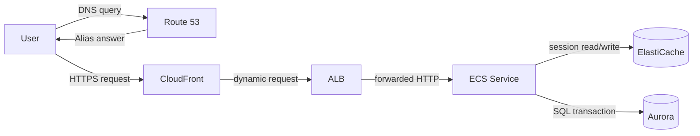

## この図が答える問い

- 名前解決と通信を分けられるか
- Edge、Entry、Compute、Stateを分けられるか
- SessionとTransactionの正本を指せるか

## この図に入れないもの

- Backup
- CI/CD
- Organizations

別の問いなので別図にする。

---

# 4. Event-driven processing

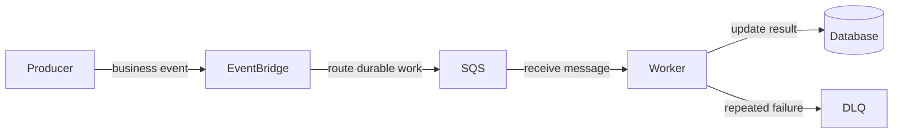

## 読むポイント

- EventBridgeはEventの振り分け
- SQSは未処理Workの保持
- Workerは処理主体
- DLQは失敗の終点ではなく調査入口

---

# 5. Workflow and compensation

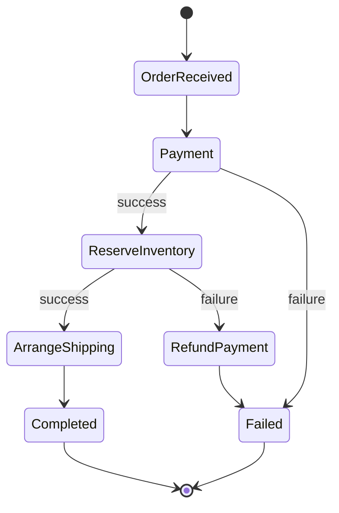

State machineは、単なるサービス接続図より、分岐と補償を表すのに向く。

---

# 6. Multi-account operating model

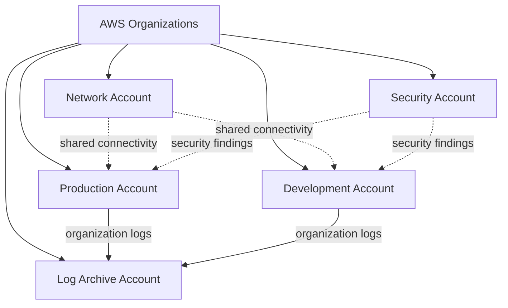

## 境界を示す

Account境界は、権限、請求、Quota、Blast radiusの境界である。

図では、Accountを箱として描くか、名前へ`Account`を含める。

---

# 7. Human access and workload access

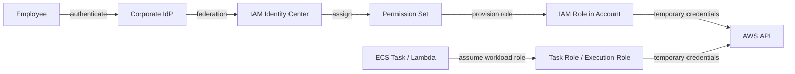

HumanとWorkloadのCredential経路を同じ線で描かない。

---

# 8. Hybrid DNS

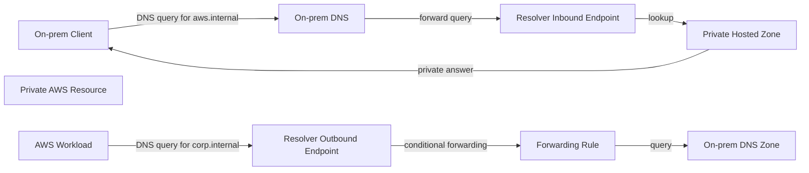

## 重要

DNS queryが成功しても、DX/VPN/TGW RouteやSecurityが成立するとは限らない。

DNS図とNetwork path図は必要に応じて分ける。

---

# 9. Multi-AZ database failover

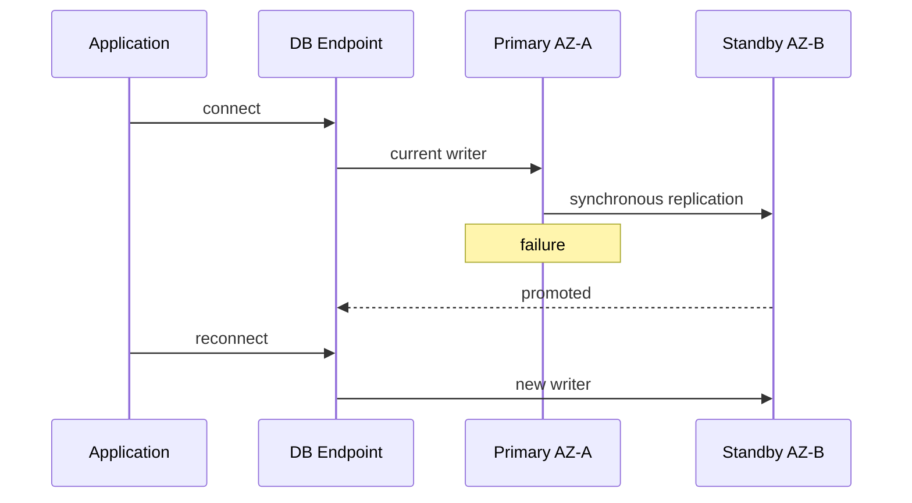

この図は次を見せる。

- Replication
- Failure
- Promotion
- Client reconnection

「Multi-AZ」と箱を二つ置くだけでは、切替過程が分からない。

---

# 10. Region DR

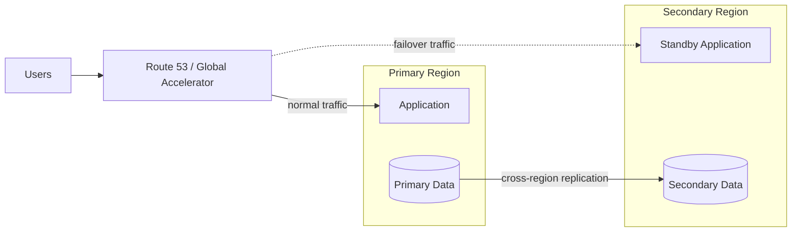

## 図だけでは不足する情報

文章で補う。

- RTO / RPO
- Secondary capacity
- Write strategy
- KMS / Secret
- Failover trigger
- Failback
- Test frequency

図は全要件を詰め込むものではない。

---

# 11. Backup and restore

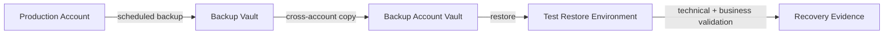

Backup取得とRestore検証を別の矢印で描く。

---

# 12. Deployment and rollback

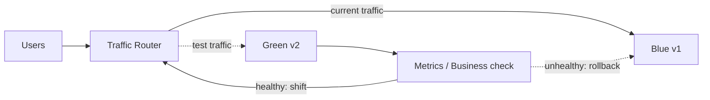

文章で補う：

- Database compatibility
- Artifact version
- Configuration
- Rollback deadline
- Success metric

---

# 13. Observability

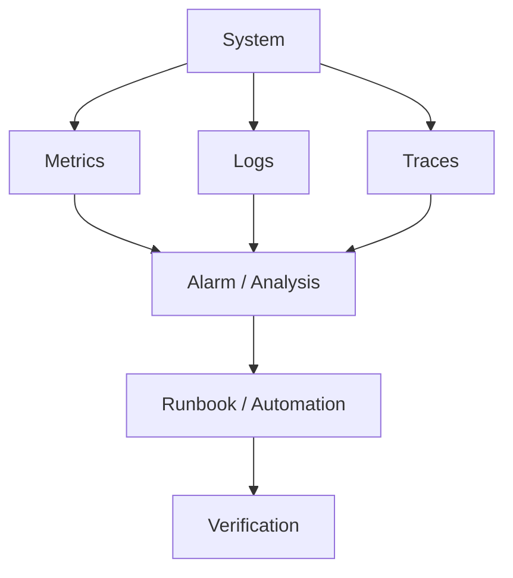

Metrics、Logs、Tracesを同じ箱にまとめず、役割を分ける。

---

# 14. Performance diagnosis

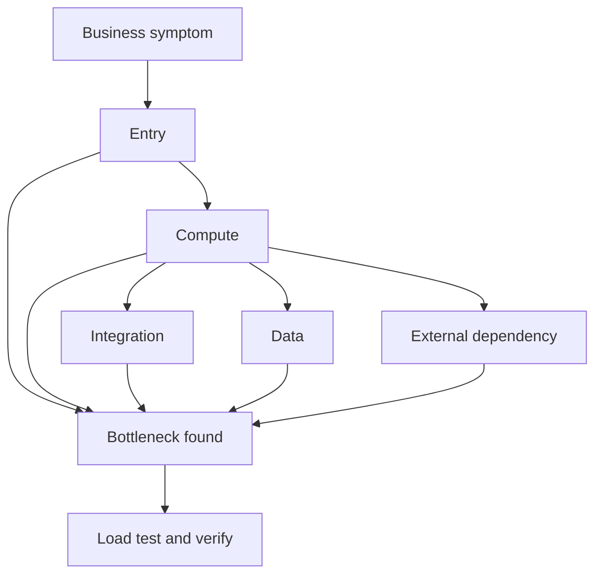

性能図では、サービス箱よりLatency内訳やQueue ageなどの数値を添えるとよい。

---

# 15. Migration timeline

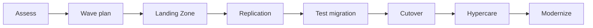

Migrationは構成図だけでなく、時間軸図が必要である。

---

# 16. Cutover sequence

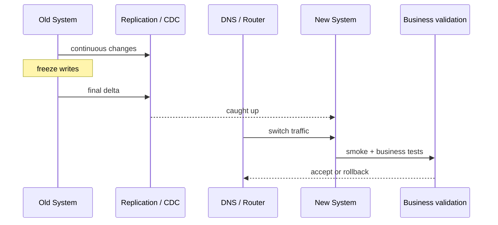

Data divergenceが始まる地点を文章で明記する。

---

# 17. 図のレビュー項目

## Flow

- StartとEndが分かるか
- 矢印に意味があるか
- 同期 / 非同期が分かるか

## State

- Source of truthが分かるか
- Cache、Replica、Backupを区別したか

## Boundary

- Account、VPC、AZ、Region、Public/Privateが分かるか

## Failure

- 何が壊れるか
- 検知と切替を描いたか

## Responsibility

- User、AWS Service、Application、Operatorを区別したか

## Density

- 一枚一問になっているか
- 15箱を超えたら分割できないか
- Legendが必要なほど複雑になっていないか

---

# 18. 図を文章へ戻すテンプレート

```text
[主体] が [入力] を [宛先] へ送る。
[中間サービス] は [判断条件] を評価し、[処理] を行う。
状態の正本は [保存先] にある。
[障害] が起きた場合、[検知] により [切替 / Retry] が行われる。
ただし [制約 / 代償] がある。
```

図を見てこの文章が作れない場合、矢印または状態の意味が不足している。
