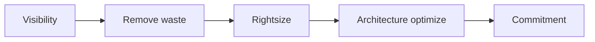

# 迷ったときのAWS意思決定マップ

このページは詳細解説ではない。

問題文や設計会議で迷った瞬間に、**何を比較すべきか**を見つけるための入口である。

---

# 1. 入口を選ぶ

| 要件 | 最初に比較する |
|---|---|
| Static contentをGlobal配信 | S3 + CloudFront |
| HTTP path / hostで振り分け | ALB |
| API認証・Throttle・Usage管理 | API Gateway |
| TCP/UDP、固定IP、低Latency | NLB / Global Accelerator |
| DNSでRegionやEndpointを選ぶ | Route 53 |

Decision rule：

> CacheするならCloudFront。HTTP内容で振り分けるならALB。APIとして管理するならAPI Gateway。TCP/UDPや固定IPならNLBまたはGlobal Accelerator。

---

# 2. Computeを選ぶ

| 要件 | 候補 |
|---|---|
| 特殊OS、Driver、完全制御 | EC2 |
| AWS中心のContainer | ECS |
| Kubernetes API / Ecosystem | EKS |
| Node管理を減らすContainer | Fargate |
| 短時間Event処理 | Lambda |
| 大量Batch job | AWS Batch |

Decision rule：

> Kubernetes要件がなければEKSを自動選択しない。Containerを維持しNode管理を減らすならECS/Fargate。短時間Event処理ならLambda。

---

# 3. 非同期連携を選ぶ

| 要件 | 候補 |
|---|---|
| Workを保持し速度差を吸収 | SQS |
| Eventを内容で振り分け | EventBridge |
| 一つのMessageを複数購読者へPush | SNS |
| 手順、分岐、Retry、補償 | Step Functions |
| 高Throughput streamとReplay | Kinesis / MSK |

Decision rule：

> Queue、Event router、Pub/Sub、Workflow、Streamを同じものとして扱わない。

---

# 4. Databaseを選ぶ

| 要件 | 候補 |
|---|---|
| SQL、Transaction、既存RDB互換 | RDS / Aurora |
| Key-value、高Scale、予測可能Access | DynamoDB |
| Cache、Session、Ranking | ElastiCache |
| Redis互換のDurable database | MemoryDB |
| Analytics / DWH | Redshift |
| Search / Log analytics | OpenSearch |
| Graph relation | Neptune |
| Document model | DocumentDB |

Decision rule：

> Database名ではなく、Data model、Access pattern、Consistency、Scale、Query形態から選ぶ。

---

# 5. Storageを選ぶ

| 要件 | 候補 |
|---|---|
| Object API、静的Data、Data lake | S3 |
| EC2のBlock disk | EBS |
| Linux NFS共有 | EFS |
| Windows SMB / AD | FSx for Windows |
| HPC、S3連携 | FSx for Lustre |
| NetApp互換 | FSx for ONTAP |
| On-premとのHybrid利用 | Storage Gateway |

Decision rule：

> Object、Block、Fileを先に分ける。共有File要件をS3へ無理に当てはめない。

---

# 6. Network接続を選ぶ

| 要件 | 候補 |
|---|---|
| 少数VPCの1対1接続 | VPC Peering |
| 多数VPC / VPN / DXのHub | Transit Gateway |
| 特定ServiceだけPrivate公開 | PrivateLink |
| 専用接続 | Direct Connect |
| Internet上の暗号化Tunnel | Site-to-Site VPN |
| Subnetを複数Accountで共有 | VPC Sharing |

Decision rule：

> VPC全体をつなぐのか、特定Serviceだけ見せるのか、同じVPCを共有するのかを先に決める。

---

# 7. DNSを選ぶ

| 要件 | 候補 |
|---|---|
| Public / Private name管理 | Route 53 Hosted Zone |
| On-premからAWS private name | Resolver Inbound Endpoint |
| AWSからOn-prem name | Resolver Outbound Endpoint + Rule |
| Region / EndpointのDNS routing | Route 53 routing policy |

Decision rule：

> DNS answerとNetwork reachabilityは別に設計する。

---

# 8. 可用性・Read scale・Recoveryを分ける

| 要件 | 候補 |
|---|---|
| DBの自動Failover | Multi-AZ |
| Read負荷分散 | Read Replica / Reader |
| 過去時点へ戻す | Backup / PITR / Snapshot |
| Cross-Region DB DR | Aurora Global Database等 |
| Server DR | Elastic Disaster Recovery |

Decision rule：

> Replicaは現在状態を追従し、Backupは過去へ戻す。Read scaleとRecoveryを混同しない。

---

# 9. DR戦略を選ぶ

| RTO / Cost | 戦略 |
|---|---|
| 長くてよい / 最小Cost | Backup & Restore |
| 中程度 / 中核だけ常時 | Pilot Light |
| 短い / 縮小版を常時 | Warm Standby |
| 最短 / 高Cost許容 | Active/Active |

Decision rule：

> RTO/RPOの数値なしにActive/Activeを選ばない。

---

# 10. Human・Workload・Application user認証を分ける

| 対象 | 候補 |
|---|---|
| Employeeの複数Account Access | IAM Identity Center |
| AWS Workloadの権限 | IAM Role |
| Customer login / JWT / MFA | Cognito User Pool |
| Browser / MobileへAWS一時Credential | Cognito Identity Pool |

Decision rule：

> 誰を認証するかを先に決める。Employee、Workload、Customerを混同しない。

---

# 11. Security serviceを目的で分ける

| 目的 | 候補 |
|---|---|
| HTTP attack filter | WAF |
| DDoS protection | Shield |
| VPC traffic firewall | Network Firewall |
| Threat detection | GuardDuty |
| Vulnerability | Inspector |
| Sensitive data discovery | Macie |
| Finding aggregation | Security Hub |
| Configuration compliance | Config |
| API audit | CloudTrail |

Decision rule：

> 防御、検知、評価、集約、監査を一つのServiceへ期待しない。

---

# 12. Migration toolを選ぶ

| 対象 | 候補 |
|---|---|
| Server | MGN |
| DB data / CDC | DMS |
| Heterogeneous schema | Schema Conversion |
| File / Object online transfer | DataSync |
| Offline large data | Snow Family |
| Existing SFTP / FTPS / AS2 | Transfer Family |

Decision rule：

> 移行対象がServer、DB、File、Interfaceのどれかを先に決める。

---

# 13. Cost改善の順序



Decision rule：

> 過剰Resourceを直す前にSavings PlansやRIを買わない。

---

# 14. 問題文のSignalから戻る

| Signal | 戻る比較 |
|---|---|
| `multiple subscribers` | SNS / EventBridge |
| `buffer unpredictable traffic` | SQS |
| `orchestrate steps` | Step Functions |
| `fixed IP` | NLB / Global Accelerator |
| `private service access` | PrivateLink |
| `connect many VPCs` | Transit Gateway |
| `minimum operations` | Managed / Serverless候補 |
| `near-zero downtime migration` | Continuous replication / CDC |
| `point-in-time recovery` | Backup / PITR |
| `read scaling` | Read Replica / Cache |
| `employee SSO` | IAM Identity Center |
| `customer JWT` | Cognito User Pool |

---

# 15. 最後に必ず書く

```text
採用:

選ぶ理由:

比較対象:

選ばない理由:

障害時:

残る運用責任:

Cost driver:
```

この七項目が書けない場合、まだサービス名で選んでいる可能性が高い。
