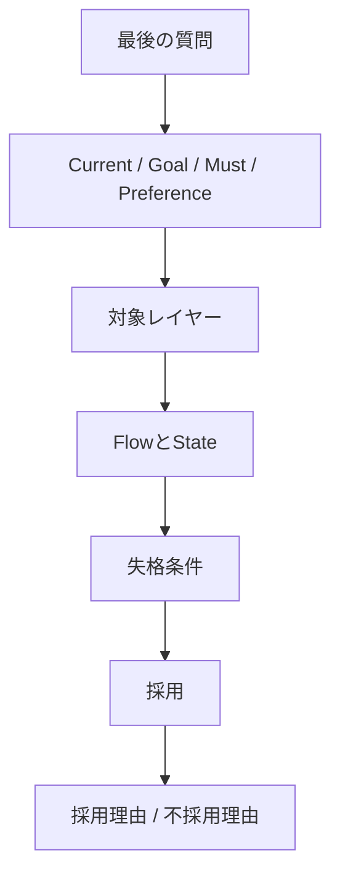

# SAP-C02 読み物ガイド

SAP-C02のドメイン別資料へ入る前に、問題文を構成図と設計判断へ変換できる状態を作る。

---

# 推奨順序

1. [START_HERE](../START_HERE.md) — 今の弱点を決める
2. [人間向けAWS設計ガイド](../guide/README.md) — Flow、State、Failure、Responsibilityを理解する
3. [SAP長文の読み方](../guide/06-sap-exam.md) — 制約語と失格条件を使う
4. [SAP-C02カバレッジマトリクス](../SAP_C02_COVERAGE_MATRIX.md) — 公式Task単位で弱点を決める
5. このディレクトリのDomain別論点
6. `practice/` のScenario問題
7. 誤答原因をガイドとカバレッジ表へ戻す

AWS用語そのものが曖昧な場合は [AWS「説明の説明」](../EXPLANATION_OF_EXPLANATIONS.md) を使う。より深い設計判断は [AWS SAP設計読本](../SAP_DESIGN_READER.md) を使う。

---

# 問題文を読む順序



---

# 一問メモ

```text
【最後の質問】
何を最適化するか:
正解数:

【Current】

【Goal】

【Must】

【Preference】

【対象レイヤー】
Network / Identity / Compute / Integration / Data / Operations / Migration

【Flow】
誰が → 何を → どこへ

【State】
Source of truth:
Replica:
Cache:
Backup:

【候補】

【失格理由】

【採用理由】

【不採用理由】
```

---

# 誤答を分類する

| 誤答原因 | 戻る場所 |
|---|---|
| 用語が分からない | [説明の説明](../EXPLANATION_OF_EXPLANATIONS.md) |
| Request / Eventの流れが見えない | [第1章](../guide/01-request-to-data.md) |
| 比較軸がない | [第2章](../guide/02-design-decisions.md) |
| HA / Backup / DRを混同 | [第3章](../guide/03-failure-recovery.md) |
| Monitoring / Deploymentが弱い | [第4章](../guide/04-operation-change.md) |
| Migrationの時間軸が弱い | [第5章](../guide/05-migration-modernization.md) |
| サービス選択で迷う | [意思決定マップ](../guide/QUICK_DECISION_MAP.md) |
| 公式範囲の位置が不明 | [カバレッジマトリクス](../SAP_C02_COVERAGE_MATRIX.md) |

---

# Domain別の見方

## Domain 1 — Organizational Complexity

主に見るもの：

- Multi-account境界
- Shared network
- Hybrid DNS / Connectivity
- Central logging / Security
- IAM federation / Delegation

図ではAccount、VPC、On-prem境界を明示する。

## Domain 2 — New Solutions

主に見るもの：

- Business goal
- Non-functional requirement
- Compute / Data / Integration選択
- Availability / DR
- Security / Cost

採用理由と不採用理由を同じ比較軸で書く。

## Domain 3 — Continuous Improvement

主に見るもの：

- Observability
- Bottleneck
- Deployment / Rollback
- Security finding
- Cost optimization
- Reliability improvement

「新しいServiceを追加する」ではなく、改善前後のMetricを考える。

## Domain 4 — Migration and Modernization

主に見るもの：

- Portfolio / Workload / Component
- 7R
- Wave
- Replication / Transfer
- Cutover / Rollback
- Hypercare / Modernization

サービス名より、時間軸とData divergenceを見る。

---

# 完了条件

SAP-C02対策の完成は、正答数だけではない。

次を説明できる状態を目指す。

```text
問題文の強い制約は何か。
対象レイヤーはどこか。
通信とDataはどう流れるか。
正本はどこか。
どこが壊れ得るか。
何を最適化するか。
なぜこの選択肢を採用し、他を落とすのか。
```
